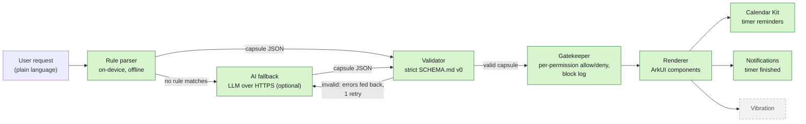

# Harmoniser

*Tiny apps, made by asking.*

**Describe a tiny app in one sentence and get it running natively on HarmonyOS. The app is plain JSON, checked against a strict schema, and can only use the device features you allow.**

Each app Harmoniser makes is a *capsule*: a small single-purpose app, such as a set of cooking timers, a squat counter or a medication checklist. It is described as JSON under the contract in [`SCHEMA.md`](SCHEMA.md). A capsule contains no code. Harmoniser reads it, rejects anything outside the schema, and draws it with native ArkUI components backed by real system services.

> **Status (2026-10-03, commit `3c9583e`):** the main screen is wired end to end. You type a request and tap **Create**, `generateCapsule` builds the capsule, the gatekeeper asks you to allow or deny each permission, and the renderer draws it. A Log screen and Undo are included. Vibration, the `motion` counter source, the `notify:<text>` action and the notification "Done" action have not been built. See [What's real and what's simulated](#whats-real-and-whats-simulated).

## Challenge themes

| Theme | How Harmoniser addresses it |
| --- | --- |
| **Intelligent Experiences** (lead) | Plain-language requests become working mini-apps. An on-device rule parser handles common requests instantly and offline. An LLM fallback handles the rest, and its output is always re-validated against the schema. |
| **Human-Centric Technology: responsible tech** | Generated apps cannot run code. Each capsule must declare the permissions it needs, and the schema blocks and logs anything it didn't declare. The API key is never packed into the public `.hap`, and with no key the app works rules-only. |

The third theme, Spatial Experiences, is not claimed.

## Architecture



Green boxes are built. The dashed grey box is planned and not yet in the code. Permissions are checked twice. The validator rejects a capsule that uses a permission it doesn't declare. Then the gatekeeper's consent screen lets the user allow or deny each declared permission. Any component or action that needs a denied permission is drawn as blocked, refused when tapped, and logged.

| Stage | Source | Notes |
| --- | --- | --- |
| Types | `entry/src/main/ets/core/CapsuleTypes.ets` | The only definition of capsule types |
| Rule parser | `core/RuleParser.ets` | Timers, counters, dose schedules, goals and bill splits. Returns `null` when no rule matches. |
| AI fallback | `core/ModelProvider.ets`, `core/CapsuleModel.ets` | Supports the Anthropic Messages API or any OpenAI-compatible chat endpoint. The request is capped at 500 characters and treated only as a description, never as instructions. |
| Validator | `core/CapsuleValidator.ets` | Rejects unknown fields, component types, actions and permissions, dangling ids, and missing permissions |
| Pipeline | `core/CapsuleGenerator.ets`, `core/index.ets` | `generateCapsule(request)` tries the rules first, then the model |
| Renderer | `renderer/CapsuleRuntime.ets`, `renderer/CapsuleView.ets` | Draws all six component types and runs actions |
| Gatekeeper | `gatekeeper/Gatekeeper.ets`, `pages/ConsentView.ets`, `pages/LogView.ets` | Per-permission allow/deny, a block log (last 200 entries) and Undo. Grants and the log persist in Preferences. |
| Main screen | `pages/Index.ets`, `pages/CapsuleStore.ets` | Request box, then **Create**, consent, and run. The active capsule is saved, so a relaunch resumes it. |
| Timer adapter | `adapters/TimerAdapter.ets` | Adds each timer to the app's own local calendar as an event with a reminder |
| Notification adapter | `adapters/NotificationAdapter.ets` | Posts "<label> is done" when a timer reaches zero (`notificationManager`). It is only active when `reminders` is allowed. |

The timer adapter uses Calendar Kit rather than `reminderAgentManager`. On phones, agent reminders need an AppGallery Connect capability grant, and without it `publishReminder` fails with error `1700002`.

Timers are saved as system Calendar events. On the emulator the calendar alert doesn't fire; on a real device, background alerts need the agent reminder capability (AppGallery approval). We'll test calendar alerts on the Pura 70.

## Setup, build, install, launch

**You need:** DevEco Studio 6.1.1 or later (HarmonyOS SDK API 24, minimum API 20), [`devecocli`](hackathon-resources/devecocli.md), and a running HarmonyOS phone emulator reachable at `127.0.0.1:5555`.

The app's bundle name is `com.hackyeah.capsules`; the repository and bundle keep the original name. Run these from the repository root:

```sh
HDC=/Applications/DevEco-Studio.app/Contents/sdk/default/openharmony/toolchains/hdc

# 1. Build the debug HAP
devecocli build --modules entry
#    -> entry/build/default/outputs/default/entry-default-unsigned.hap

# 2. Install on the emulator (-r replaces an existing install)
$HDC -t 127.0.0.1:5555 install -r entry/build/default/outputs/default/entry-default-unsigned.hap

# 3. Launch
$HDC -t 127.0.0.1:5555 shell aa start -a EntryAbility -b com.hackyeah.capsules
```

`build-profile.json5` has no `signingConfigs`, so the HAP is unsigned. The emulator accepts it, but a physical device needs signing (`devecocli auth login`, then `devecocli signature generate`).

### Optional: enable the AI fallback

With no config file the app runs rules-only and reports "AI fallback not configured." To enable the fallback, create `config.local.json` in the repository root. This file is git-ignored and never packed into the `.hap`:

```json
{ "provider": "anthropic", "apiKey": "<your key>" }
```

`"provider": "openai"` also works with any OpenAI-compatible endpoint; it needs `"model"` and optionally `"baseUrl"`. Push the file to the app's private files directory after installing:

```sh
$HDC -t 127.0.0.1:5555 file send -b com.hackyeah.capsules config.local.json data/storage/el2/base/files/
```

Never put the key in `entry/src/main/resources/rawfile/`, because that folder is packed into the `.hap`.

### Run the unit tests

```sh
DEVECO_SDK_HOME=/Applications/DevEco-Studio.app/Contents/sdk \
  /Applications/DevEco-Studio.app/Contents/tools/hvigor/bin/hvigorw \
  --mode module -p module=entry@default -p product=default test --no-daemon
tail -1 entry/.test/default/intermediates/test/coverage_data/test_result.txt
# Tests run: 35, Failure: 0, Error: 0, Pass: 35, Ignore: 0
```

## What's real and what's simulated

| Feature | Status |
| --- | --- |
| Schema v0 validator | **Real.** Unit-tested. |
| On-device rule parser | **Real.** Unit-tested, and every rule's output is checked against the validator. |
| AI fallback (model call, validate, one corrective retry) | **Implemented and unit-tested against a fake HTTP transport.** The config is loaded at startup and `ohos.permission.INTERNET` is declared, but the fallback has not been run against a real provider on the device. |
| Typing a request in the app | **Real.** Text box, then **Create**, then `generateCapsule`, then consent, then render |
| Renderer (text, timer, counter, checklist, number, button) | **Real.** Draws the generated capsule |
| Gatekeeper (allow/deny per permission, block log, Undo) | **Real.** Grants and the log persist in Preferences. Undo deletes the capsule and its calendar events, and forgets its grants. |
| In-app timer countdown | **Real** |
| Timers saved as system Calendar events | **Real** (Calendar Kit). They appear in the system Calendar app, labelled "Capsules". |
| Calendar alert with the app closed | **Not working on the emulator.** It will be tested on a Pura 70. |
| Notification when a timer ends | **Real** (`notificationManager`), only while the app is running and only if `reminders` is allowed |
| `motion` counter source | **Not built.** The counter only counts manual taps for now. |
| `notify:<text>` button action | **Planned.** The validator accepts it and the gatekeeper checks it, but the runtime does nothing yet. |
| Vibration | **Planned** |
| Time-of-day reminders, computed values | **Not in schema v0.** "Medication 8am and 8pm" becomes a dose checklist, and bill splits are worked out once as static text. |

No sensor or device data is currently simulated.

## Third-party components and licences

| Component | Used for | Licence |
| --- | --- | --- |
| [`@ohos/hypium`](https://ohpm.openharmony.cn/#/cn/detail/@ohos%2Fhypium) 1.0.25 | Unit test framework (development only) | Apache-2.0 |
| [`@ohos/hamock`](https://ohpm.openharmony.cn/#/cn/detail/@ohos%2Fhamock) 1.0.0 | Mocking for tests (development only) | Apache-2.0 |
| HarmonyOS SDK kits (ArkUI, Calendar Kit, Network Kit, Core File Kit, Ability Kit) | Platform APIs | Part of the HarmonyOS SDK |
| Remote LLM, optional (Anthropic API, default model `claude-sonnet-5-5`, or any OpenAI-compatible endpoint) | AI fallback, only when the user supplies a key | Bound by the provider's terms. No model weights are bundled. |

**Cactus and LFM2 are not used.** There is no on-device LLM runtime or bundled model. The only on-device "intelligence" is the rule parser.

Harmoniser's own licence has not been chosen yet.

AI-assisted development is recorded in [`AI_WORKFLOW.md`](AI_WORKFLOW.md).

## How to verify each feature

| Feature | Steps | Expected |
| --- | --- | --- |
| Build | Run step 1 above | `BUILD SUCCESSFUL`, and the `.hap` exists |
| Validator, rule parser, model fallback | [Run the unit tests](#run-the-unit-tests) | `Pass: 35`. This includes bad JSON, unknown component, unknown action, missing permission, rules-first, model fallback and "not configured" cases. |
| Create a capsule | Type `pasta 9 min, sauce 15 min, bread 6 min`, then tap **Create** | The consent screen lists `reminders`. Allow it and tap **Run capsule** to see the three timers. |
| Gatekeeper block | Same steps, but leave `reminders` set to Deny | Every timer and the start button show "Blocked … needs reminders (denied by user)". **Log** lists each block. |
| Undo | Tap **Undo** on a running capsule | You return to the create screen with "Removed …; cancelled N calendar reminder(s)" |
| In-app timers | Tap the capsule's start button | The timers count down. The log shows `dispatch startAllTimers` (`$HDC -t 127.0.0.1:5555 shell hilog \| grep dispatch`). |
| Calendar permission | First launch | The system asks for calendar access with the reason "Capsule timers are saved as calendar reminders…" |
| Timers in the system calendar | Start a capsule's timers, then open the system Calendar app | Today's events include "<label> is done" in the "Capsules" calendar |
| Timer-end notification | Create a capsule with a 1-minute timer, start it, and keep the app open | A "<label> is done" notification appears |
| Rules-only without a key | Launch without pushing `config.local.json`, then run `$HDC -t 127.0.0.1:5555 shell hilog \| grep initCapsuleModel` | No crash, and the log shows `initCapsuleModel ready=false`. `pasta 9 min, sauce 15 min, bread 6 min` still creates a capsule. A request no rule understands, e.g. `plan my week`, shows "No built-in rule understands this request. AI fallback not configured." |
| AI config loaded | Push `config.local.json` (see above), relaunch, run the same `grep initCapsuleModel` | The log shows `initCapsuleModel ready=true` |
