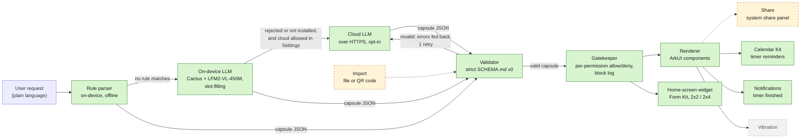

# Harmoniser

*Tiny apps, made by asking.*

**Describe a tiny app in one sentence and get it running natively on HarmonyOS. The app is plain JSON, checked against a strict schema, and can only use the device features you allow.**

Each app Harmoniser makes is a *capsule*: a small single-purpose app, such as a set of cooking timers, a squat counter or a medication checklist. It is described as JSON under the contract in [`SCHEMA.md`](SCHEMA.md). A capsule contains no code. Harmoniser reads it, rejects anything outside the schema, and draws it with native ArkUI components backed by real system services.

> **Status (2026-10-03, commit `37a8ce0`):** the main screen is wired end to end. You type a request (or tap an example chip) and tap **Create**. `generateCapsule` builds the capsule: rules first, then an on-device LLM (Cactus with LFM2-VL-450M), then the cloud model, but only if you turn on **Allow cloud AI fallback** in Settings (off by default). The gatekeeper sheet asks you to allow or deny each permission, and the capsule joins a grid of saved capsules. Each one has a badge showing how it was made, and opens into a detail view. A Log screen, Remove (Undo) and a home-screen widget that stays in sync with the app are included. Capsule sharing (export, and import from a file or QR code) is built but not yet on any screen. Schema v1 is approved in `SCHEMA.md` but not yet implemented; the validator accepts v0 only. Vibration, the `motion` counter source, the `notify:<text>` action and the notification "Done" action have not been built. See [What's real and what's simulated](#whats-real-and-whats-simulated).

## Challenge themes

| Theme | How Harmoniser addresses it |
| --- | --- |
| **Intelligent Experiences** (lead) | Plain-language requests become working mini-apps. An on-device rule parser handles common requests instantly. A small on-device LLM (LFM2-VL-450M on the Cactus engine) handles many of the rest without a network. An optional cloud LLM comes last. Every capsule, whatever produced it, is re-validated against the schema. |
| **Human-Centric Technology: responsible tech** | Generated apps cannot run code. Each capsule must declare the permissions it needs; the validator rejects anything undeclared, and the gatekeeper blocks and logs anything the user denied. Every capsule shows whether it was made by rules, on-device or in the cloud. Cloud AI is off by default ("Off: requests never leave the device"). The on-device model runs locally, with Cactus's telemetry stubbed out so the engine makes no network calls. The cloud API key is never packed into the public `.hap`. |

The third theme, Spatial Experiences, is not claimed.

## Architecture



Green boxes are built. Dashed amber boxes are built and unit-tested but not yet on any screen. The dashed grey box is planned and not yet in the code. The on-device and cloud models each get one corrective retry, and both outputs go through the validator. Permissions are checked twice. The validator rejects a capsule that uses a permission it doesn't declare. Then the gatekeeper's consent screen lets the user allow or deny each declared permission. Any component or action that needs a denied permission is drawn as blocked, refused when tapped, and logged.

| Stage | Source | Notes |
| --- | --- | --- |
| Types | `entry/src/main/ets/core/CapsuleTypes.ets` | The only definition of capsule types |
| Rule parser | `core/RuleParser.ets` | Timers, counters, dose schedules, goals, bill splits and checklists. Returns `null` when no rule matches. |
| On-device LLM | `core/providers/CactusProvider.ets`, `cactus/` (HAR: prebuilt `libcactus_engine.so` for arm64-v8a, Node-API wrapper) | The model only picks an intent and fills slots, and code builds the capsule. Slots must be grounded in the request: every word slot shares a word with it, and every number appears in it. Inference runs off the UI thread. The model weights are not in the `.hap`. |
| Cloud LLM | `core/ModelProvider.ets`, `core/CapsuleModel.ets` | Supports the Anthropic Messages API or any OpenAI-compatible chat endpoint. The request is capped at 500 characters and treated only as a description, never as instructions. |
| Validator | `core/CapsuleValidator.ets` | Rejects unknown fields, component types, actions and permissions, dangling ids, and missing permissions |
| Pipeline | `core/CapsuleGenerator.ets`, `core/index.ets` | `generateCapsule(request, { allowCloud })` runs rules, then on-device, then cloud. A rule match returns at once, without waiting for the on-device model to load. Every capsule is validated again, whichever source made it. The result's `origin` is `rules`, `on-device` or `cloud`. |
| Renderer | `renderer/CapsuleRuntime.ets`, `renderer/CapsuleView.ets` | Draws all six component types and runs actions |
| Gatekeeper | `gatekeeper/Gatekeeper.ets`, `pages/ConsentView.ets`, `pages/LogView.ets` | A consent bottom sheet with an allow/deny switch per permission, a block log (last 200 entries) and Remove. Grants and the log persist in Preferences. |
| Main screen | `pages/Index.ets`, `pages/CapsuleStore.ets`, `pages/CapsuleEntry.ets` | A "What do you need?" box with example chips, then **Create**, then the consent sheet. Saved capsules appear as a 2-column grid of cards showing live state, an origin badge ("Made by rules" / "Made on-device" / "Made in the cloud") and "Add to home screen" when the capsule fits a widget. A card opens a detail view with **Remove capsule**. If a request can't be built, a fixed friendly message and suggestion chips are shown, and the real error goes to hilog. |
| Settings | `pages/SettingsView.ets`, `pages/AppSettings.ets` | **Allow cloud AI fallback**, off by default and saved in Preferences. It is passed to `generateCapsule` as `allowCloud`. |
| Timer adapter | `adapters/TimerAdapter.ets` | Adds each timer to the app's own local calendar as an event with a reminder |
| Notification adapter | `adapters/NotificationAdapter.ets` | Posts "<label> is done" when a timer reaches zero (`notificationManager`). It is only active when `reminders` is allowed. |
| Widget router | `core/CapsuleRouter.ets` | Decides whether a capsule fits a widget: at most 4 components, only timer, counter, checklist, text or button, checklists of at most 6 items, and no number inputs |
| Widget model | `core/WidgetModel.ets` | Pure logic: saved widget state, the card view, mapping taps to the capsule's declared actions, and choosing which capsule a new widget shows. Components whose permission isn't granted are hidden. |
| Widget | `widget/HarmoniserFormAbility.ets`, `widget/WidgetService.ets`, `widget/WidgetStore.ets`, `widget/pages/HarmoniserCard.ets` | Form Kit card, 2x2 and 2x4. A new widget shows the most recent widget-suitable capsule. It has live timer countdowns with start, counters with +, and tickable checklists. Taps are checked against the gatekeeper, and tapping the card opens the app. The widget keeps its capsule across app updates, and its state (timers, counts, ticks) syncs both ways with the app. |
| Sharing | `sharing/` (`CapsuleShare`, `ShareExport`, `ImportFlow`, `SharingBar`) | Export writes `capsule-<id>.json` and opens the system share panel (Share Kit). Import accepts a `.json` file (Document picker) or a QR code (Scan Kit). It enforces an 8 KB cap and validates before anything else. It replaces the sender's id and never carries over permission grants. `SharingBar` is not yet placed on any page. |

The timer adapter uses Calendar Kit rather than `reminderAgentManager`. On phones, agent reminders need an AppGallery Connect capability grant, and without it `publishReminder` fails with error `1700002`.

Timers are saved as system Calendar events. On the emulator the calendar alert doesn't fire; on a real device, background alerts need the agent reminder capability (AppGallery approval). We'll test calendar alerts on the Pura 70.

## Setup, build, install, launch

**You need:** DevEco Studio 6.1.1 or later (HarmonyOS SDK API 24, minimum API 20), [`devecocli`](hackathon-resources/devecocli.md), and a running HarmonyOS phone emulator reachable at `127.0.0.1:5555`.

The app's bundle name is `com.hackyeah.capsules`; the repository and bundle keep the original name. Run these from the repository root:

```sh
HDC=/Applications/DevEco-Studio.app/Contents/sdk/default/openharmony/toolchains/hdc

# 1. Build the debug HAP
devecocli build --modules entry
#    -> entry/build/default/outputs/default/entry-default-unsigned.hap

# 2. Install on the emulator (-r replaces an existing install)
$HDC -t 127.0.0.1:5555 install -r entry/build/default/outputs/default/entry-default-unsigned.hap

# 3. Launch
$HDC -t 127.0.0.1:5555 shell aa start -a EntryAbility -b com.hackyeah.capsules
```

`build-profile.json5` has no `signingConfigs`, so the HAP is unsigned. The emulator accepts it, but a physical device needs signing (`devecocli auth login`, then `devecocli signature generate`).

### Optional: enable the cloud AI fallback

Cloud AI needs both a key file and the **Allow cloud AI fallback** switch in Settings (gear icon), which is off by default. Without them, requests are handled by rules and the on-device model only, and the home status line shows "Cloud AI off". To add a key, create `config.local.json` in the repository root. This file is git-ignored and never packed into the `.hap`:

```json
{ "provider": "anthropic", "apiKey": "<your key>" }
```

`"provider": "openai"` also works with any OpenAI-compatible endpoint; it needs `"model"` and optionally `"baseUrl"`. Push the file to the app's private files directory after installing:

```sh
$HDC -t 127.0.0.1:5555 file send -b com.hackyeah.capsules config.local.json data/storage/el2/base/files/
```

Never put the key in `entry/src/main/resources/rawfile/`, because that folder is packed into the `.hap`.

### Optional: install the on-device model

The weights (about 480 MB) are not in the repository or the `.hap`. Download and unzip [`lfm2-vl-450m-cq4.zip`](https://huggingface.co/Cactus-Compute/LFM2-VL-450M/resolve/v2.0/lfm2-vl-450m-cq4.zip) (tag `v2.0`), then push the folder to the app after installing. This works on debug builds only:

```sh
scripts/push-model.sh ~/models/lfm2-vl-450m-cq4
$HDC -t 127.0.0.1:5555 shell "aa force-stop com.hackyeah.capsules; aa start -a EntryAbility -b com.hackyeah.capsules"
```

Without the model, on-device inference is skipped and its status reads "On-device model not installed". Cactus ships only for arm64-v8a.

### Run the unit tests

```sh
DEVECO_SDK_HOME=/Applications/DevEco-Studio.app/Contents/sdk \
  /Applications/DevEco-Studio.app/Contents/tools/hvigor/bin/hvigorw \
  --mode module -p module=entry@default -p product=default test --no-daemon
tail -1 entry/.test/default/intermediates/test/coverage_data/test_result.txt
# Tests run: 74, Failure: 0, Error: 0, Pass: 74, Ignore: 0
```

## What's real and what's simulated

| Feature | Status |
| --- | --- |
| Schema v0 validator | **Real.** Unit-tested. |
| Schema v1 (state, computed values, safe expressions, new components) | **Specified only.** Approved in `SCHEMA.md`. The validator still rejects `schemaVersion` 1. |
| On-device rule parser | **Real.** Unit-tested, and every rule's output is checked against the validator. |
| On-device LLM (Cactus + LFM2-VL-450M) | **Real, partly verified.** On the emulator the engine loads (`cactus_init ok in 310.7 ms`) and decodes at 92–113 tokens/s. On a 10-request eval it was 5/10 correct, 0 valid-but-wrong and 5 rejected cleanly; that run was in a separate spike harness, not this app's UI. It is not yet demonstrated through the main screen. Performance on a real phone has not been measured, and offline use was not strictly tested (emulator airplane mode doesn't cut its network). |
| Cloud LLM (model call, validate, one corrective retry) | **Implemented and unit-tested against a fake HTTP transport.** It is opt-in through Settings, the config is loaded at startup, and `ohos.permission.INTERNET` is declared. It has not been run against a real provider on the device. |
| Typing a request in the app | **Real.** Text box or example chip, then **Create**, then `generateCapsule`, then the consent sheet, then the saved grid. Checked on the emulator with cloud off: the checklist, `3 timers …` and `pasta 9 min, sauce 15 min, bread 6 min` requests were all made by rules. |
| Origin badges and cloud opt-in setting | **Real** |
| Renderer (text, timer, counter, checklist, number, button) | **Real.** Draws the generated capsule |
| Gatekeeper (allow/deny per permission, block log, Remove) | **Real.** Grants and the log persist in Preferences. Remove deletes the capsule and its calendar events, and forgets its grants. |
| In-app timer countdown | **Real** |
| Timers saved as system Calendar events | **Real** (Calendar Kit). They appear in the system Calendar app in a calendar shown as "Harmoniser". |
| Calendar alert with the app closed | **Not working on the emulator.** It will be tested on a Pura 70. |
| Notification when a timer ends | **Real** (`notificationManager`), only while the app is running and only if `reminders` is allowed |
| Home-screen widget (Form Kit, 2x2 and 2x4) | **Real.** Checked on the emulator: 2x2 and 2x4 widgets added from the picker, timers counted down, + updated every widget showing that capsule, checklist items ticked and unticked, and widgets kept their capsule after reinstall. Two-way state sync with the app was added in `d36455d`; its commit doesn't record an emulator check. |
| Capsule sharing (export, import from file or QR) | **Built and unit-tested** (import/export rules, round trip). It is not on any screen yet, so it hasn't been exercised in the app. |
| `widget` permission in the schema | **Not used.** A capsule goes on a widget because of its shape (see Widget router), not because it declares `widget`. |
| `motion` counter source | **Not built.** The counter only counts manual taps for now. |
| `notify:<text>` button action | **Planned.** The validator accepts it and the gatekeeper checks it, but the runtime does nothing yet. |
| Vibration | **Planned** |
| Time-of-day reminders, computed values | **Not in schema v0** (computed values are part of the v1 spec). "Medication 8am and 8pm" becomes a dose checklist, and bill splits are worked out once as static text. |

No sensor or device data is currently simulated.

## Third-party components and licences

| Component | Used for | Licence |
| --- | --- | --- |
| [`@ohos/hypium`](https://ohpm.openharmony.cn/#/cn/detail/@ohos%2Fhypium) 1.0.25 | Unit test framework (development only) | Apache-2.0 |
| [`@ohos/hamock`](https://ohpm.openharmony.cn/#/cn/detail/@ohos%2Fhamock) 1.0.0 | Mocking for tests (development only) | Apache-2.0 |
| HarmonyOS SDK kits (ArkUI, Calendar Kit, Notification Kit, Form Kit, Share Kit, Scan Kit, Network Kit, Core File Kit, ArkData, Ability Kit) | Platform APIs | Part of the HarmonyOS SDK |
| [Cactus](https://github.com/cactus-compute/cactus) v2.2.2 (commit `2cfcdb8`), cross-compiled for OHOS with [our patch](cactus/cactus-ohos.patch) | On-device inference engine, **bundled in the `.hap`** | [Cactus Compute licence](cactus/CACTUS_LICENSE): source-available, **not OSI open source**. Free only for individuals (personal, educational, research or non-commercial use), organisations under $2M in funding and $2M in revenue, educational institutions and students, and non-profits. Anyone else needs a commercial licence. |
| [LFM2-VL-450M](https://huggingface.co/LiquidAI/LFM2-VL-450M) (Liquid AI), Cactus `cq4` build from [`Cactus-Compute/LFM2-VL-450M`](https://huggingface.co/Cactus-Compute/LFM2-VL-450M) | On-device model, **not bundled**; each user downloads it | [LFM Open License v1.0](https://huggingface.co/LiquidAI/LFM2-VL-450M/blob/main/LICENSE): Apache-2.0-style, with commercial use limited to entities under $10M annual revenue |
| Remote LLM, optional (Anthropic API, default model `claude-sonnet-5-5`, or any OpenAI-compatible endpoint) | Cloud fallback, only when the user supplies a key | Bound by the provider's terms |

More detail, including the patch contents and the model checksum, is in [`docs/THIRD_PARTY.md`](docs/THIRD_PARTY.md).

Harmoniser's own licence has not been chosen yet.

AI-assisted development is recorded in [`AI_WORKFLOW.md`](AI_WORKFLOW.md).

## How to verify each feature

| Feature | Steps | Expected |
| --- | --- | --- |
| Build | Run step 1 above | `BUILD SUCCESSFUL`, and the `.hap` exists |
| Validator, rule parser, provider chain, widget router, widget model, sharing | [Run the unit tests](#run-the-unit-tests) | `Tests run: 74`, `Pass: 74`. The tests cover bad JSON, unknown component, unknown action and missing permission. They also check that the rule parser runs first and short-circuits, that on-device is preferred over cloud, cloud fallback, `allowCloud: false`, "not configured", each timer phrasing, widget routing and taps, and the import/export rules. |
| Create a capsule | Type `pasta 9 min, sauce 15 min, bread 6 min`, then tap **Create** | The consent sheet lists Reminders. Allow it and tap **Run capsule**. A card appears under "Your capsules" with "Made by rules". Open it to see the three timers. |
| Gatekeeper block | Same steps, but leave Reminders denied | Each timer and the start button show "Blocked timer" / "Blocked button" with "needs reminders (denied by user)". The log (document icon, top right) lists each block. |
| Remove (Undo) | Open a capsule, then tap **Remove capsule** | You return home with "Removed …; cancelled N calendar reminder(s)" |
| In-app timers | Tap the capsule's start button | The timers count down. The log shows `dispatch startAllTimers` (`$HDC -t 127.0.0.1:5555 shell hilog \| grep dispatch`). |
| Calendar permission | First launch | The system asks for calendar access with the reason "Capsule timers are saved as calendar reminders…" |
| Timers in the system calendar | Start a capsule's timers, then open the system Calendar app | Today's events include "<label> is done" in the "Harmoniser" calendar |
| Timer-end notification | Create a capsule with a 1-minute timer, start it, and keep the app open | A "<label> is done" notification appears |
| Rules and on-device only (cloud off) | Launch with the Settings switch off (the default) | The home status line shows "Cloud AI off". `pasta 9 min, sauce 15 min, bread 6 min` still creates a capsule. A request nothing can build shows "I couldn't build that offline. Try rephrasing…" with suggestion chips and a link to Settings. |
| Cloud AI enabled | Push `config.local.json` (see above), relaunch, turn on **Allow cloud AI fallback**, then run `$HDC -t 127.0.0.1:5555 shell hilog \| grep initCapsuleModel` | The log shows `initCapsuleModel ready=true`. A request that rules and on-device can't build gets "Made in the cloud". |
| Home-screen widget | Create and run `pasta 9 min, sauce 15 min, bread 6 min`. On the home screen, long-press, open **Widgets**, and add **Harmoniser**. | The card shows the three timers. Tapping start counts down on the card, and tapping the card opens the app. |
| On-device model loaded | [Install the model](#optional-install-the-on-device-model), relaunch, then run `$HDC -t 127.0.0.1:5555 shell hilog \| grep cactus_init` | `cactus_init ok in … ms` |
| On-device generation | With the model installed and cloud off, type a request no rule understands, e.g. `track pages I read`, then tap **Create** | When it succeeds, the card shows "Made on-device". This hasn't been demonstrated through the UI yet. About half of non-rule requests are rejected cleanly, and those show the friendly message instead. |
