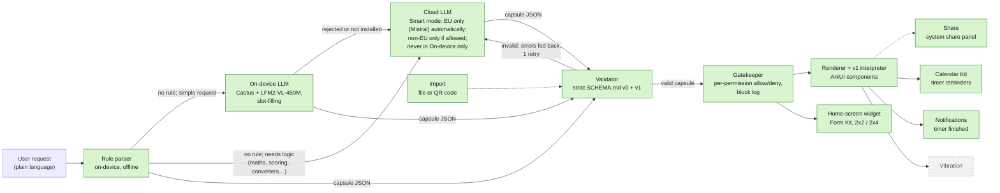

# Harmoniser

*Tiny apps, made by asking.*

**Describe a tiny app in one sentence and get it running natively on HarmonyOS. The app is plain JSON, checked against a strict schema, and can only use the device features you allow.**

Each app Harmoniser makes is a *capsule*: a small single-purpose app, such as a set of cooking timers, a squat counter or a medication checklist. It is described as JSON under the contract in [`SCHEMA.md`](SCHEMA.md). A capsule contains no code. Harmoniser reads it, rejects anything outside the schema, and draws it with native ArkUI components backed by real system services.

> **Status (2026-10-03, commit `b6bf925`):** the main screen is wired end to end. You type a request (the box rotates through "Try: …" examples) and tap **Create**. `generateCapsule` routes it. Rules go first. Plain timers, counters and checklists then go to the on-device LLM (Cactus with LFM2-VL-450M). Requests that need logic (maths, scoring, converters, quizzes, streaks, inputs) go to the cloud first. In the default **Smart** mode the cloud is used automatically only with an EU provider (Mistral), after a one-time notice; non-EU providers need an extra switch, and **On-device only** mode never uses the cloud. The gatekeeper sheet asks you to allow or deny each permission, and the capsule joins a grid of saved capsules. Each one has a badge showing how it was made, and opens into a detail view with Share and Remove. Import is on the home screen. Capsules made by rules or on-device offer **Make it smarter with <provider>**, which rebuilds them in the cloud. A Log screen and a home-screen widget that stays in sync with the app are included. Schema v1 capsules (live state and computed values) are built and run on the emulator. Both the cloud model and the rule parser produce them (goals and bill splits). Vibration, the `motion` counter source, the `notify:<text>` action and the notification "Done" action have not been built. See [What's real and what's simulated](#whats-real-and-whats-simulated).

## Challenge themes

| Theme | How Harmoniser addresses it |
| --- | --- |
| **Intelligent Experiences** (lead) | Plain-language requests become working mini-apps. An on-device rule parser handles common requests instantly. A small on-device LLM (LFM2-VL-450M on the Cactus engine) handles many simple ones without a network. Requests that need logic, such as a tennis scoreboard, a unit converter or a live bill split, are routed to a cloud LLM, which builds schema v1 capsules with live state and computed values. Every capsule, whatever produced it, is re-validated against the schema. |
| **Human-Centric Technology: responsible tech** | Generated apps cannot run code. Each capsule must declare the permissions it needs; the validator rejects anything undeclared, and the gatekeeper blocks and logs anything the user denied. Every capsule shows whether it was made by rules, on-device, in the cloud or by someone else. Cloud use is EU-only by default (Mistral). Before a provider's first request, a notice names that provider, says whether it is outside the EU and that only the request text is sent, and lets you switch to On-device only. Consent is stored per provider, so agreeing to Mistral doesn't cover Claude. Requests for things capsules can't do by design (contacts, SMS, web data, camera, payments and similar) are refused with a plain explanation, rather than turned into a weaker app. Imported capsules always go through the consent sheet, and nothing is saved until you run them. The on-device model runs locally, with Cactus's telemetry stubbed out so the engine makes no network calls. The cloud API key is never packed into the public `.hap`; a byte scan of the rebuilt `.hap` found none. |

The third theme, Spatial Experiences, is not claimed.

## Architecture



Green boxes are built. The dashed grey box is planned and not yet in the code. Imported capsules go through the validator and the gatekeeper sheet like any other. The on-device and cloud models each get one corrective retry, and both outputs go through the validator. Permissions are checked twice. The validator rejects a capsule that uses a permission it doesn't declare. Then the gatekeeper's consent screen lets the user allow or deny each declared permission. Any component or action that needs a denied permission is drawn as blocked, refused when tapped, and logged.

| Stage | Source | Notes |
| --- | --- | --- |
| Types | `entry/src/main/ets/core/CapsuleTypes.ets` | The only definition of capsule types |
| Rule parser | `core/RuleParser.ets` | Timers, counters, dose schedules, goals, bill splits and checklists. Goals (for progress units such as glasses, pages, steps or km, or an explicit goal) and bill splits come out as live v1 capsules, e.g. "{count} / 8 · {8 - count} to go". Requests that mention score, game, players, quiz, convert, calculate or streak are skipped and left for the cloud. Returns `null` when no rule matches. |
| On-device LLM | `core/providers/CactusProvider.ets`, `cactus/` (HAR: prebuilt `libcactus_engine.so` for arm64-v8a, Node-API wrapper) | The model only picks an intent and fills slots, and code builds the capsule. Slots must be grounded in the request: every word slot shares a word with it, and every number appears in it. Inference runs off the UI thread. If grounding catches a value copied from a prompt example, the retry drops that example. A scoreboard intent builds 2 or more named counters. The model weights are not in the `.hap`. It produces v0 capsules only. |
| Cloud LLM | `core/ModelProvider.ets`, `core/CapsuleModel.ets` | Supports the Anthropic Messages API, Mistral (JSON output mode, OpenAI-compatible endpoint) or any OpenAI-compatible chat endpoint. Generation is two-step. The model first lists what the app must do (up to 8 points), then writes the capsule from that plan. The capsule is validated, with one retry that quotes the validator's exact errors. Then the model checks the capsule against every point and may revise it once. A revision is kept only if it also passes the validator, so a failed plan or check never loses a valid capsule. The plan step can refuse instead: `{"error"}` for requests that aren't an app (e.g. "asdf") and `{"unsupported": [...]}` for capabilities capsules don't have. These come back as `ok: false` with failure `not-an-app` or `unsupported`. Smart routing returns them as they are, with no on-device fallback, and sends requests that mention such capabilities to the cloud first. Output is capped at 8192 tokens (Claude used up 2048 on planning). The prompt teaches schema v0 and v1 with two v1 examples. The request is capped at 500 characters and treated only as a description, never as instructions. |
| Validator | `core/CapsuleValidator.ets` | Rejects unknown fields, component types, actions and permissions, dangling ids, and missing permissions. For v1 it also type-checks every expression, checks every name exists, rejects computed cycles, and enforces the limits (60 components, nesting depth 5, 30 state values, 30 computed values, 20 steps per button). `{name}` placeholders are allowed only in `display` templates; anywhere else they are rejected, so they never appear literally on screen. |
| Expressions and interpreter (v1) | `core/Expr.ets`, `core/CapsuleProgram.ets`, `core/V1Fixtures.ets` | Expressions are parsed by our own lexer and parser with static types and a step budget, never `eval`. The pure interpreter runs button steps all-or-nothing (`applyActions`), handles input binding (`setInput`) and `{expr}` templates. Tennis scoreboard and bill-split fixtures are included. |
| Pipeline | `core/CapsuleGenerator.ets`, `core/index.ets` | `generateCapsule(request, { mode, allowNonEu })` runs the rules first; a match returns at once. `needsLogic` sends maths, scoring, converting, conditions, inputs, lists, quizzes and streaks to the cloud first. Everything else goes on-device, then to the cloud. Cloud is used automatically only with EU providers. Non-EU providers need `allowNonEu`, and mode `on-device-only` never calls the cloud. If the cloud hasn't been allowed yet, a logic request returns `needsCloud` so the app can ask. `cloudOnly` skips rules and on-device for **Make it smarter**, and still respects the mode and the non-EU setting. Only the system prompt and the request text are sent. Every capsule is validated again. Origins are `rules`, `on-device`, `cloud-eu:mistral`, `cloud:anthropic`, `cloud:openai` or (in the app) `imported`. |
| Renderer | `renderer/CapsuleRuntime.ets`, `renderer/CapsuleView.ets` | Draws the six v0 component types and the v1 ones (display, input, list, when, row), recursively. A v1 button press runs the interpreter, then the gatekeeper must allow every resulting v0 action before any state changes. `enabledIf` disables buttons. v1 state values are saved per capsule. |
| Gatekeeper | `gatekeeper/Gatekeeper.ets`, `pages/ConsentView.ets`, `pages/LogView.ets` | A consent bottom sheet with an allow/deny switch per permission, a block log (last 200 entries) and Remove. It also gates components nested inside `when` and `row`. Grants and the log persist in Preferences. |
| Main screen | `pages/Index.ets`, `pages/CapsuleStore.ets`, `pages/CapsuleEntry.ets` | A "What do you need?" box with a rotating "Try: …" placeholder, an Import icon next to Settings and Log, then **Create**, then the consent sheet. The AI status line sits on its own line under the input card. The first request to each cloud provider shows a one-time notice naming it: "Use Mistral AI (EU)?" or "Use Claude (outside the EU)?". **OK** sends it, and **On-device only** switches mode. A refused request shows "Harmoniser can't do <x> by design. Capsules can only use: …" without suggestion chips or a cloud notice. Saved capsules appear as a 2-column grid of cards showing live state, an origin badge and "Add to home screen" when the capsule fits a widget. A card opens a detail view with **Share** and **Remove capsule**. The "Add to home screen" how-to is open on the first view and collapsed after that, and the route text reads "Opens in the app" or "Simple enough for a widget". Capsules made by rules or on-device show **Make it smarter with <provider>**. It rebuilds the saved request in the cloud (with the one-time notice if needed), shows the consent sheet again, and on **Run** replaces the old capsule. If a request can't be built, a fixed friendly message and suggestion chips are shown, and the real error goes to hilog. The hidden requests `demo tennis` and `demo bill split` load the v1 fixtures. |
| Settings | `pages/SettingsView.ets`, `pages/AppSettings.ets` | **AI mode**: Smart ("On-device + Mistral EU when needed", default) or On-device only ("Requests never leave the device"). Under **Advanced**, **Allow non-EU providers** is off by default. Both are saved in Preferences and enforced by core. |
| Timer adapter | `adapters/TimerAdapter.ets` | Adds each timer to the app's own local calendar as an event with a reminder |
| Notification adapter | `adapters/NotificationAdapter.ets` | Posts "<label> is done" when a timer reaches zero (`notificationManager`). It is only active when `reminders` is allowed. |
| Widget router | `core/CapsuleRouter.ets` | Decides whether a capsule fits a widget: at most 4 components, only timer, counter, checklist, text or button, checklists of at most 6 items, no number inputs, and no v1 features (state, computed values, `do` buttons). |
| Widget model | `core/WidgetModel.ets` | Pure logic: saved widget state, the card view, mapping taps to the capsule's declared actions, and choosing which capsule a new widget shows. Components whose permission isn't granted are hidden. |
| Widget | `widget/HarmoniserFormAbility.ets`, `widget/WidgetService.ets`, `widget/WidgetStore.ets`, `widget/pages/HarmoniserCard.ets` | Form Kit card, 2x2 and 2x4. A new widget shows the most recent widget-suitable capsule. It has live timer countdowns with start, counters with +, and tickable checklists. Taps are checked against the gatekeeper, and tapping the card opens the app. The widget keeps its capsule across app updates, and its state (timers, counts, ticks) syncs both ways with the app. |
| Sharing | `sharing/` (`CapsuleShare`, `ShareExport`, `ImportFlow`, `SharingBar`) | Export writes `capsule-<id>.json` and opens the system share panel (Share Kit). Import accepts a `.json` file (Document picker) or a QR code (Scan Kit). It enforces an 8 KB cap and validates before anything else. It replaces the sender's id and never carries over permission grants. An imported capsule shows the consent sheet with a "From someone else" badge, and is saved only when you run it. |

The timer adapter uses Calendar Kit rather than `reminderAgentManager`. On phones, agent reminders need an AppGallery Connect capability grant, and without it `publishReminder` fails with error `1700002`.

Timers are saved as system Calendar events. On the emulator the calendar alert doesn't fire; on a real device, background alerts need the agent reminder capability (AppGallery approval). We'll test calendar alerts on the Pura 70.

## On-device AI: the Cactus port

[Cactus](https://github.com/cactus-compute/cactus) had no HarmonyOS build, so we ported it.

- **Cross-compile:** Cactus v2.2.2 (commit `2cfcdb8`) is built for arm64-v8a with the OHOS NDK toolchain, using 3 small patches ([`cactus/cactus-ohos.patch`](cactus/cactus-ohos.patch)). A no-op telemetry stub replaces the libcurl-based telemetry, so the engine makes no network calls. Two `emplace_back` aggregate initialisations are rewritten for the SDK's Clang 15. The result is `libcactus_engine.so`: 3.5 MB, 2.5 MB stripped, with 182 exported `cactus_*` symbols. It needs only OHOS libc and `libc++_shared.so`.
- **Node-API wrapper:** our own C++ (`cactus/src/main/cpp/napi_init.cpp`) exposes `initModel`, `complete` and `freeModel` to ArkTS as Promises. They run on the libuv worker pool, so inference never blocks the UI thread. The HAR adds about 3.8 MB to the `.hap`: the engine, `libcactus_napi.so` (75 KB) and `libc++_shared.so` (1.2 MB).
- **Model:** LFM2-VL-450M in Cactus's 4-bit `cq4` format, 383 MB zipped and about 480 MB on the device. It is pushed into the app's sandbox with `hdc file send -b` and never packed into the `.hap`.
- **Slot-filling instead of free generation:** given the full schema, the 450M model copied prompt examples and printed placeholders. Only 3 of 10 capsules were correct, and gemma-4-E2B at 2-bit got 0/10. So the model now only picks an intent and fills grounded slots, and code builds the capsule.

Measured on the HarmonyOS emulator. It runs on the host's Apple M4 Pro cores, so **a phone will be slower; we haven't measured one**.

| Metric | Result |
| --- | --- |
| Model load (`cactus_init`) | 256 ms in the spike, 310.7 ms in the app |
| Time to first token | 267–386 ms for a 29-token prompt. A 350–600-token prompt raised it to 1.2–1.6 s, which is one reason the slot-filling prompt is kept short. |
| Decode / prefill | 92–114 tokens/s / 75–108 tokens/s |
| Memory | 335–388 MB RSS reported by Cactus; 245 MB process PSS, because the weights are memory-mapped |
| Capsule accuracy | 9/15 correct on the eval requests with the app's provider code; 11/15 with the rule parser in front |

## AI evaluation

`scripts/eval-providers.mjs` runs requests through each configured cloud provider, using the app's own prompt, validator and v1 interpreter. It checks both that the capsule is valid and that it does the right thing. The prompt was tuned on 15 requests and then locked. The 5 held-out requests were written afterwards and never used for tuning.

| Set | Mistral `ministral-14b-latest` (EU) | Anthropic `claude-sonnet-5-5` |
| --- | --- | --- |
| Tuning set (15) | 15/15 on the final run (earlier runs ranged from 12 to 14) | 15/15 |
| Held-out set (5) | 3/5 | 5/5 |
| Hard logic requests (4): tennis scoreboard, darts for 3 players, quiz on capitals, reading streak | **2/4** | **4/4** |

On the hard requests, Ministral built the tennis scoreboard and darts correctly. The quiz and the habit streak failed both attempts: the model used step types and functions the schema doesn't have. The validator rejected both, so no wrong capsule reached the user, but those requests fail. Claude was correct on all four, and faster on the tennis scoreboard (12 s against 22 s). We still default to Mistral because it is hosted in the EU. That is a deliberate privacy-over-accuracy trade-off. Claude is available only if you turn on **Allow non-EU providers**. These are small samples, and the numbers are indicative, not a benchmark.

## Setup, build, install, launch

**You need:** DevEco Studio 6.1.1 or later (HarmonyOS SDK API 24, minimum API 20), [`devecocli`](hackathon-resources/devecocli.md), and a running HarmonyOS phone emulator reachable at `127.0.0.1:5555`.

The app's bundle name is `com.hackyeah.capsules`; the repository and bundle keep the original name. Run these from the repository root:

```sh
HDC=/Applications/DevEco-Studio.app/Contents/sdk/default/openharmony/toolchains/hdc

# 1. Build the debug HAP
devecocli build --modules entry
#    -> entry/build/default/outputs/default/entry-default-unsigned.hap

# 2. Install on the emulator (-r replaces an existing install)
$HDC -t 127.0.0.1:5555 install -r entry/build/default/outputs/default/entry-default-unsigned.hap

# 3. Launch
$HDC -t 127.0.0.1:5555 shell aa start -a EntryAbility -b com.hackyeah.capsules
```

`build-profile.json5` has no `signingConfigs`, so the HAP is unsigned. The emulator accepts it, but a physical device needs a signed HAP.

**Signing for a physical device:** in DevEco Studio, open **File → Project Structure → Signing Configs**, sign in with your Huawei ID, and tick **Automatically generate signature**. Then rebuild. `devecocli signature generate` is not an option here, because it only works for mainland-China accounts. DevEco writes the signing paths and encrypted passwords into `build-profile.json5`. Don't commit that change, and never commit the generated `.p12`, `.cer` or `.p7b` files (they are git-ignored).

### Optional: enable the cloud AI fallback

Cloud AI needs a key file. In the default **Smart** mode an EU provider (`mistral`) is then used automatically when needed, after a one-time notice. `anthropic` and `openai` are used only if you turn on **Settings → Advanced → Allow non-EU providers**. **On-device only** mode never uses the cloud. The home status line shows the on-device model's state and the cloud state, e.g. "Mistral (EU) when needed" or "No EU cloud provider". To add a key, create `config.local.json` in the repository root. This file is git-ignored and never packed into the `.hap`:

```json
{ "provider": "anthropic", "apiKey": "<your key>" }
```

The providers are `anthropic`, `mistral` and `openai`. `openai` covers any OpenAI-compatible endpoint; it needs `"model"` and optionally `"baseUrl"`. To list several providers, name the one the app uses in `default`:

```json
{ "default": "mistral", "providers": { "mistral": { "apiKey": "<key>", "model": "ministral-14b-latest" }, "anthropic": { "apiKey": "<key>" } } }
```

Which Mistral models a key can call depends on its tier. To compare providers, `node scripts/eval-providers.mjs` runs the tuning, held-out and refusal requests (nonsense and unsupported capabilities) through every provider in the file, using the app's own prompt and validator, and prints valid/correct counts per provider side by side. Add `--only mistral` to run one provider, `--match tennis,darts` to run only matching requests, or `--out results.json` to save the results. It needs Node 18+ and network access, and downloads esbuild through `npx` on first run.

Push the file to the app's private files directory after installing:

```sh
$HDC -t 127.0.0.1:5555 file send -b com.hackyeah.capsules config.local.json data/storage/el2/base/files/
```

Never put the key in `entry/src/main/resources/rawfile/`, because that folder is packed into the `.hap`.

### Optional: install the on-device model

The weights (about 480 MB) are not in the repository or the `.hap`. Download and unzip [`lfm2-vl-450m-cq4.zip`](https://huggingface.co/Cactus-Compute/LFM2-VL-450M/resolve/v2.0/lfm2-vl-450m-cq4.zip) (tag `v2.0`), then push the folder to the app after installing. This works on debug builds only:

```sh
scripts/push-model.sh ~/models/lfm2-vl-450m-cq4
$HDC -t 127.0.0.1:5555 shell "aa force-stop com.hackyeah.capsules; aa start -a EntryAbility -b com.hackyeah.capsules"
```

Without the model, on-device inference is skipped and its status reads "On-device model not installed". Cactus ships only for arm64-v8a.

### Run the unit tests

```sh
DEVECO_SDK_HOME=/Applications/DevEco-Studio.app/Contents/sdk \
  /Applications/DevEco-Studio.app/Contents/tools/hvigor/bin/hvigorw \
  --mode module -p module=entry@default -p product=default test --no-daemon
tail -1 entry/.test/default/intermediates/test/coverage_data/test_result.txt
# Tests run: 148, Failure: 0, Error: 0, Pass: 148, Ignore: 0
```

## What's real and what's simulated

| Feature | Status |
| --- | --- |
| Schema v0 validator | **Real.** Unit-tested. |
| Schema v1 (state, computed values, safe expressions, new components) | **Real.** Validator, interpreter, renderer and router are unit-tested, including a full tennis scoreboard (15/30/40, deuce, advantage, games) and a live bill split. On the emulator, `demo tennis` (deuce, "Advantage P1", Reset enabled only after a point) and `demo bill split` (inputs update "Each pays") render and work. Mistral built a v1 Reading Log in the app. |
| On-device rule parser | **Real.** Unit-tested, and every rule's output is checked against the validator. |
| On-device LLM (Cactus + LFM2-VL-450M) | **Real, partly verified.** On the emulator the engine loads (`cactus_init ok in 310.7 ms`) and decodes at 92–113 tokens/s. On a 15-request eval on the emulator, using the app's provider code, it got 9/15 correct, and the full chain with rules got 11/15. It is not yet demonstrated through the main screen. Performance on a real phone has not been measured, and offline use was not strictly tested (emulator airplane mode doesn't cut its network). |
| Cloud LLM (model call, validate, one corrective retry) | **Real.** In the app on the emulator, a request the on-device model couldn't build showed the notice, **OK** sent it to Mistral, and Mistral returned a valid v1 capsule. Eval with the app's locked prompt and validator: on the tuning set (15), Mistral `ministral-14b-latest` 15/15 and Anthropic `claude-sonnet-5-5` 15/15. On the held-out set (5, never used for tuning), Mistral 3/5 and Anthropic 5/5; the validator rejected both Mistral failures. Anthropic has not been exercised in the app. |
| Typing a request in the app | **Real.** Text box, then **Create**, then `generateCapsule`, then the consent sheet, then the saved grid. Checked on the emulator: the checklist, `3 timers …` and `pasta 9 min, sauce 15 min, bread 6 min` requests were made by rules. |
| Origin badges, AI mode setting, per-provider cloud notice | **Real.** Each cloud provider has its own badge: "Made with Mistral (EU)", "Made with Claude" or "Made with OpenAI". The per-provider notice (`bef3b2b`) is in code, but its commit doesn't record an emulator check. |
| Refusing unsupported or nonsense requests | **Implemented and unit-tested; eval has a refusal set.** The "can't do … by design" card has no recorded emulator check. **Known mismatch:** the card's list of what capsules can use includes vibration and the motion sensor, but neither is built yet (see below). |
| v1 number and text inputs | **Real.** Checked on the emulator: typing replaces the value (bill split, km to miles, quiz topic) |
| Make it smarter (cloud rebuild) | **Real.** On the emulator, a rules-made quiz capsule was rebuilt with Claude (non-EU allowed on that device). The consent sheet showed "Made with Claude", and **Run** replaced the old capsule. The `cloudOnly` follow-up (`58839bf`), for requests that match a built-in rule, is unit-tested; its commit doesn't record an emulator check. |
| Renderer, v0 components (text, timer, counter, checklist, number, button) | **Real.** Draws the generated capsule |
| Gatekeeper (allow/deny per permission, block log, Remove) | **Real.** Grants and the log persist in Preferences. Remove deletes the capsule and its calendar events, and forgets its grants. |
| In-app timer countdown | **Real** |
| Timers saved as system Calendar events | **Real** (Calendar Kit). They appear in the system Calendar app in a calendar shown as "Harmoniser". |
| Calendar alert with the app closed | **Not working on the emulator.** It will be tested on a Pura 70. |
| Notification when a timer ends | **Real** (`notificationManager`), only while the app is running and only if `reminders` is allowed |
| Home-screen widget (Form Kit, 2x2 and 2x4) | **Real.** Checked on the emulator: 2x2 and 2x4 widgets added from the picker, timers counted down, + updated every widget showing that capsule, checklist items ticked and unticked, and widgets kept their capsule after reinstall. Two-way state sync with the app was added in `d36455d`; its commit doesn't record an emulator check. |
| Capsule sharing (export, import from file or QR) | **Import from file: real.** On the emulator, importing a `.json` from Downloads showed the consent sheet with "From someone else", saved nothing before **Run**, and the detail page showed the badge plus Share and Import. Export through the share panel and import by QR code are unit-tested but not yet exercised on the emulator. |
| `widget` permission in the schema | **Not used.** A capsule goes on a widget because of its shape (see Widget router), not because it declares `widget`. |
| `motion` counter source | **Not built.** The counter only counts manual taps for now. |
| `notify:<text>` button action | **Planned.** The validator accepts it and the gatekeeper checks it, but the runtime does nothing yet. |
| Vibration | **Planned** |
| Time-of-day reminders | **Not in the schema.** "Medication 8am and 8pm" becomes a dose checklist. (Bill splits are now live v1 capsules.) |

No sensor or device data is currently simulated.

## Third-party components and licences

| Component | Used for | Licence |
| --- | --- | --- |
| [`@ohos/hypium`](https://ohpm.openharmony.cn/#/cn/detail/@ohos%2Fhypium) 1.0.25 | Unit test framework (development only) | Apache-2.0 |
| [`@ohos/hamock`](https://ohpm.openharmony.cn/#/cn/detail/@ohos%2Fhamock) 1.0.0 | Mocking for tests (development only) | Apache-2.0 |
| HarmonyOS SDK kits (ArkUI, Calendar Kit, Notification Kit, Form Kit, Share Kit, Scan Kit, Network Kit, Core File Kit, ArkData, Ability Kit) | Platform APIs | Part of the HarmonyOS SDK |
| [Cactus](https://github.com/cactus-compute/cactus) v2.2.2 (commit `2cfcdb8`), cross-compiled for OHOS with [our patch](cactus/cactus-ohos.patch) | On-device inference engine, **bundled in the `.hap`** | [Cactus Compute licence](cactus/CACTUS_LICENSE): source-available, **not OSI open source**. Free only for individuals (personal, educational, research or non-commercial use), organisations under $2M in funding and $2M in revenue, educational institutions and students, and non-profits. Anyone else needs a commercial licence. |
| [LFM2-VL-450M](https://huggingface.co/LiquidAI/LFM2-VL-450M) (Liquid AI), Cactus `cq4` build from [`Cactus-Compute/LFM2-VL-450M`](https://huggingface.co/Cactus-Compute/LFM2-VL-450M) | On-device model, **not bundled**; each user downloads it | [LFM Open License v1.0](https://huggingface.co/LiquidAI/LFM2-VL-450M/blob/main/LICENSE): Apache-2.0-style, with commercial use limited to entities under $10M annual revenue |
| Remote LLM, optional: Anthropic API (default model `claude-sonnet-5-5`), Mistral API (default `mistral-large-latest`; we use `ministral-14b-latest`), or any OpenAI-compatible endpoint | Cloud fallback, only when the user supplies a key and allows cloud AI | Bound by the provider's terms |
| [esbuild](https://esbuild.github.io/), fetched by `npx` | Bundles core for `scripts/eval-providers.mjs` (development only, not in the `.hap`) | MIT |

More detail, including the patch contents and the model checksum, is in [`docs/THIRD_PARTY.md`](docs/THIRD_PARTY.md).

Harmoniser's own code is licensed under the [Apache License 2.0](LICENSE). That includes our Node-API wrapper in `cactus/src/main/cpp/`. The prebuilt Cactus engine (`cactus/libs/`) and our patch to it stay under the [Cactus Compute licence](cactus/CACTUS_LICENSE). The LFM2 model weights are not in this repository.

AI-assisted development is recorded in [`AI_WORKFLOW.md`](AI_WORKFLOW.md).

## How to verify each feature

| Feature | Steps | Expected |
| --- | --- | --- |
| Build | Run step 1 above | `BUILD SUCCESSFUL`, and the `.hap` exists |
| Validator, rule parser, provider chain, schema v1, widget router, widget model, sharing | [Run the unit tests](#run-the-unit-tests) | `Tests run: 148`, `Pass: 148`. The tests cover bad JSON, unknown component, unknown action and missing permission. They also check that the rule parser runs first and short-circuits, that on-device is preferred over cloud, cloud fallback, `allowCloud: false`, "not configured", each timer phrasing, smart routing (logic requests go to the cloud first, EU only unless `allowNonEu`, `on-device-only` never calls the cloud, `needsCloud`, only the request text in the HTTP body), refusals (`not-an-app`, `unsupported`), the Mistral provider and multi-provider config, widget routing and taps, and the import/export rules. For v1 they cover the tennis scoreboard, the live bill split, all-or-nothing steps, computed cycles, limits and runtime presses. |
| Create a capsule | Type `pasta 9 min, sauce 15 min, bread 6 min`, then tap **Create** | The consent sheet lists Reminders. Allow it and tap **Run capsule**. A card appears under "Your capsules" with "Made by rules". Open it to see the three timers. |
| Gatekeeper block | Same steps, but leave Reminders denied | Each timer and the start button show "Blocked timer" / "Blocked button" with "needs reminders (denied by user)". The log (document icon, top right) lists each block. |
| Remove (Undo) | Open a capsule, then tap **Remove capsule** | You return home with "Removed …; cancelled N calendar reminder(s)" |
| In-app timers | Tap the capsule's start button | The timers count down. The log shows `dispatch startAllTimers` (`$HDC -t 127.0.0.1:5555 shell hilog \| grep dispatch`). |
| Calendar permission | First launch | The system asks for calendar access with the reason "Capsule timers are saved as calendar reminders…" |
| Timers in the system calendar | Start a capsule's timers, then open the system Calendar app | Today's events include "<label> is done" in the "Harmoniser" calendar |
| Timer-end notification | Create a capsule with a 1-minute timer, start it, and keep the app open | A "<label> is done" notification appears |
| On-device only mode | **Settings → AI mode → On-device only** | The status line ends with "On-device only". `pasta 9 min, sauce 15 min, bread 6 min` still creates a capsule. A request nothing on the device can build shows "I couldn't build that offline. Try rephrasing…" with suggestion chips. |
| EU cloud in Smart mode | Push a `config.local.json` with a `mistral` key, relaunch (Smart is the default), and ask `km to miles converter` | The status line shows "Mistral (EU) when needed". The first time, a "Use Mistral AI (EU)?" notice appears; tap **OK**. A v1 capsule is made, badged "Made with Mistral (EU)". |
| Home-screen widget | Create and run `pasta 9 min, sauce 15 min, bread 6 min`. On the home screen, long-press, open **Widgets**, and add **Harmoniser**. | The card shows the three timers. Tapping start counts down on the card, and tapping the card opens the app. |
| On-device model loaded | [Install the model](#optional-install-the-on-device-model), relaunch, then run `$HDC -t 127.0.0.1:5555 shell hilog \| grep cactus_init` | `cactus_init ok in … ms` |
| On-device generation | With the model installed, type a simple request no rule understands, e.g. `track pages I read`, then tap **Create** | When it succeeds, the card shows "Made on-device". This hasn't been demonstrated through the UI yet. It got 9/15 correct on the eval. Requests it can't build show the friendly message instead. |
| Cloud provider comparison | Put one or more keys in the root `config.local.json`, then run `node scripts/eval-providers.mjs` | Valid/correct counts per provider out of 15 |
| Schema v1 in the app | Type `demo tennis`, then `demo bill split`, and run each | Tennis: tapping a player's point goes 15/30/40, then deuce and "Advantage …", and Reset is enabled only after a point. Bill split: changing the inputs updates "Each pays". Neither is widget-eligible. |
| Import a capsule | Put a capsule `.json` in Downloads, tap the Import icon (top right of the home screen), then **From file** | The consent sheet shows the capsule with "From someone else". Cancel saves nothing. **Run** adds it to the grid. |
| Make it smarter | Create `count my squats` (made by rules), open it, and tap **Make it smarter with …** | The notice appears if you haven't accepted it yet. Then a cloud-built capsule appears in the consent sheet with its provider badge, and **Run** replaces the old one. |
| Live goal (rules, v1; **not yet verified on the emulator**) | Create `water 8 glasses` | "Made by rules". It shows "0 / 8 · 8 to go", +1 counts up, and it reaches "Goal reached!". It opens in the app, not as a widget. |
| Refusal (**not yet verified on the emulator**) | With cloud available, ask `read my contacts and text them happy birthday` | "Harmoniser can't do contacts and SMS by design. Capsules can only use: …" No capsule is made. |
