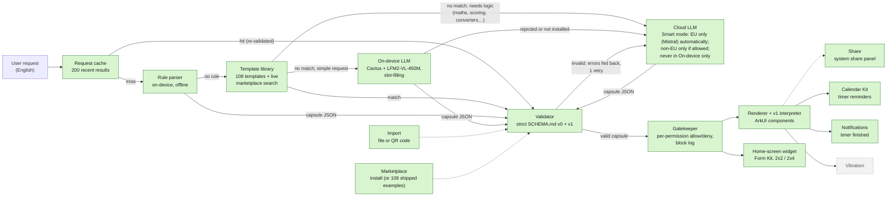

# Harmoniser

*Tiny apps, made by asking.*

**Describe a tiny app in one sentence and get it running natively on HarmonyOS. The app is plain JSON, checked against a strict schema, and can only use the device features you allow.**

**Built at HackYeah 2026.** The project started from the HackYeah Hackathon Template, which gave the empty ArkTS project, `AGENTS.md`, `AI_WORKFLOW.md` and `hackathon-resources/`. Everything else was built during the hackathon; the commit history shows how. More docs: [AI integration](docs/AI_INTEGRATION.md), [compliance audit](docs/COMPLIANCE.md), [demo script](docs/DEMO_SCRIPT.md), [widget research](docs/WIDGET_RESEARCH.md) (AI-assisted, nothing run on a device), [pitch outline](docs/SLIDES_OUTLINE.md), [third-party notes](docs/THIRD_PARTY.md).

Each app Harmoniser makes is a *capsule*: a small single-purpose app, such as a set of cooking timers, a squat counter or a medication checklist. It is described as JSON under the contract in [`SCHEMA.md`](SCHEMA.md). A capsule contains no code. Harmoniser reads it, rejects anything outside the schema, and draws it with native ArkUI components backed by real system services.

> **Status (2026-10-04; last full docs pass at commit `6c7e71f`, then corrected against `main` at `bfa70f5` and again at `b54cbfe`, after PRs #14, #15 and #16 were merged, by reading the code; nothing was built, and only the rule parser was run, outside the app):** **English only:** Harmoniser understands English requests; anything else gets "Harmoniser understands English for now. Try: 'timer 10 minutes'." without reaching any model. The main screen is wired end to end. You type a request (the box rotates through "Try: …" examples) and tap **Create**. `generateCapsule` routes it. A request cache and the rules go first, then the 108 built-in templates. Plain timers, counters and checklists that none of those cover then go to the on-device LLM (Cactus with LFM2-VL-450M). Requests that need logic (maths, scoring, converters, quizzes, streaks, inputs) go to the cloud first. In the default **Smart** mode the cloud is used automatically only with an EU provider (Mistral), after a one-time notice; non-EU providers need an extra switch, and **On-device only** mode never uses the cloud. The gatekeeper sheet asks you to allow or deny each permission, and the capsule joins a grid of saved capsules. Each one has a badge showing how it was made, and opens into a detail view with Share and Remove. A floating bottom tab bar switches between **Create**, **Capsules**, **Marketplace** and **Settings** (UI-2); import is the icon on the Capsules tab. Capsules made by rules or on-device offer **Make it smarter with <provider>**, which rebuilds them in the cloud. Each capsule page has its log in the header. A home-screen widget that stays in sync with the app is included. Schema v1 capsules (live state and computed values) are built and run on the emulator. Both the cloud model and the rule parser produce them (goals and bill splits). Vibration in capsules, the `notify:<text>` action and the notification "Done" action have not been built. The `motion` counter source (it counts shakes, not steps or reps), the battery reading and the weather reading are in the code since `547d27b`; their status is in the table below. A weather request for one bundled city works. The combined request `a task list and the weather for Kraków` builds one capsule by rule, a task list with the weather, on `main` since PR #14 (verified by unit tests; emulator run reported by the author; not re-run); some close phrasings still miss the rule (see the Weather row). See [What's real and what's simulated](#whats-real-and-whats-simulated).

## Challenge themes

| Theme | How Harmoniser addresses it |
| --- | --- |
| **Intelligent Experiences** (lead) | Plain-language requests become working mini-apps. An on-device rule parser handles common requests instantly. A small on-device LLM (LFM2-VL-450M on the Cactus engine) handles many simple ones without a network. Requests that need logic, such as a tennis scoreboard, a unit converter or a live bill split, are routed to a cloud LLM, which builds schema v1 capsules with live state and computed values. Every capsule, whatever produced it, is re-validated against the schema. |
| **Human-Centric Technology: responsible tech** | Generated apps cannot run code. Each capsule must declare the permissions it needs; the validator rejects anything undeclared, and the gatekeeper blocks and logs anything the user denied. Every capsule shows whether it was made by rules, on-device, in the cloud or by someone else. Cloud use is EU-only by default (Mistral). Before a provider's first request, a notice names that provider, says whether it is outside the EU and that only the request text is sent, and lets you switch to On-device only. Consent is stored per provider, so agreeing to Mistral doesn't cover Claude. Requests for actions capsules can't do (sending SMS, calls, reading contacts, sending email, browsing websites, payments) are refused with a plain explanation, rather than turned into a weaker app. That refusal is made by the cloud model's planning step, so it needs cloud AI: with no cloud provider configured, or in **On-device only** mode, such a request goes to the on-device model and is not refused (see [Capsule permissions and refusals](#capsule-permissions-and-refusals)). Imported capsules always go through the consent sheet, and nothing is saved until you run them. The on-device model runs locally, with Cactus's telemetry stubbed out so the engine makes no network calls. The cloud API key is never packed into the public `.hap`; a byte scan of a rebuilt `.hap` on 2026-10-03 found none (not re-run on the final build). |

The third theme, Spatial Experiences, is not claimed.

## Architecture



Green boxes are built. The dashed grey box is planned and not yet in the code. Imported capsules go through the validator and the gatekeeper sheet like any other. The on-device and cloud models each get one corrective retry, and both outputs go through the validator. Permissions are checked twice. The validator rejects a capsule that uses a permission it doesn't declare. Then the gatekeeper's consent screen lets the user allow or deny each declared permission. Any component or action that needs a denied permission is drawn as blocked, refused when tapped, and logged.

| Stage | Source | Notes |
| --- | --- | --- |
| Types | `entry/src/main/ets/core/CapsuleTypes.ets` | The only definition of capsule types |
| Rule parser | `core/RuleParser.ets` | Timers, counters, dose schedules, goals, bill splits and checklists. `pomodoro` (25/5, or e.g. `pomodoro 50/10`) and any focus/work plus break/rest pair become timers that take turns: **Start break** stops focus, and **Start focus** stops the break. Goals (for progress units such as glasses, pages, steps or km, or an explicit goal) and bill splits come out as live v1 capsules, e.g. "{count} / 8 · {8 - count} to go". Requests that mention score, game, players, quiz, convert, calculate or streak are skipped and left for the cloud. Returns `null` when no rule matches. |
| On-device LLM | `core/providers/CactusProvider.ets`, `cactus/` (HAR: prebuilt `libcactus_engine.so` for arm64-v8a, Node-API wrapper) | The model only picks an intent and fills slots, and code builds the capsule. Slots must be grounded in the request: every word slot shares a word with it, and every number appears in it. Inference runs off the UI thread. If grounding catches a value copied from a prompt example, the retry drops that example. A scoreboard intent builds 2 or more named counters. The model weights are not in the `.hap`. It produces v0 capsules only. |
| Cloud LLM | `core/ModelProvider.ets`, `core/CapsuleModel.ets` | Supports the Anthropic Messages API, Mistral (JSON output mode, OpenAI-compatible endpoint) or any OpenAI-compatible chat endpoint. Generation is two-step. The model first lists what the app must do (up to 8 points), then writes the capsule from that plan. The capsule is validated, with one retry that quotes the validator's exact errors. Then the model checks the capsule against every point and may revise it once. A revision is kept only if it also passes the validator, so a failed plan or check never loses a valid capsule. The plan step can refuse instead: `{"error"}` for requests that aren't an app (e.g. "asdf") and `{"unsupported": [...]}` for capabilities capsules don't have. These come back as `ok: false` with failure `not-an-app` or `unsupported`. Smart routing returns them as they are, with no on-device fallback, and sends requests that mention such capabilities to the cloud first. There is no local refusal: without a usable cloud provider the same request falls through to the on-device model (`generateCapsuleWith` in `core/CapsuleGenerator.ets`). Output is capped at 8192 tokens (Claude used up 2048 on planning). The prompt teaches schema v0 and v1 with two v1 examples. The request is capped at 500 characters and treated only as a description, never as instructions. |
| Validator | `core/CapsuleValidator.ets` | Rejects unknown fields, component types, actions and permissions, dangling ids, and missing permissions. For v1 it also type-checks every expression, checks every name exists, rejects computed cycles, and enforces the limits (60 components, nesting depth 5, 30 state values, 30 computed values, 20 steps per button). `{name}` placeholders are allowed only in `display` templates; anywhere else they are rejected, so they never appear literally on screen. |
| Expressions and interpreter (v1) | `core/Expr.ets`, `core/CapsuleProgram.ets`, `core/V1Fixtures.ets` | Expressions are parsed by our own lexer and parser with static types and a step budget, never `eval`. The pure interpreter runs button steps all-or-nothing (`applyActions`), handles input binding (`setInput`) and `{expr}` templates. Tennis scoreboard and bill-split fixtures are included. |
| Pipeline | `core/CapsuleGenerator.ets`, `core/index.ets` | `generateCapsule(request, { mode, allowNonEu })` first checks the request cache (model-made capsules per normalised request, re-validated; **Make it smarter** skips it), then runs the rules (a match returns at once), then the template library. `needsLogic` sends maths, scoring, converting, conditions, inputs, lists, quizzes and streaks to the cloud first. Everything else goes on-device, then to the cloud. Cloud is used automatically only with EU providers. Non-EU providers need `allowNonEu`, and mode `on-device-only` never calls the cloud. If the cloud hasn't been allowed yet, a logic request returns `needsCloud` so the app can ask. `cloudOnly` skips rules and on-device for **Make it smarter**, and still respects the mode and the non-EU setting. Only the system prompt and the request text are sent. Every capsule is validated again. Origins are `rules`, `on-device`, `cloud-eu:mistral`, `cloud:anthropic`, `cloud:openai` or (in the app) `imported`. |
| Renderer | `renderer/CapsuleRuntime.ets`, `renderer/CapsuleView.ets` | Draws the six v0 component types and the v1 ones (display, input, list, when, row), recursively. A v1 button press runs the interpreter, then the gatekeeper must allow every resulting v0 action before any state changes. `enabledIf` disables buttons. v1 state values are saved per capsule. Running timers have **Pause**/**Resume** and **Stop**. The schema actions `pauseTimer`, `stopTimer` and `resetTimer` (approved by Ash) also work in buttons, v1 steps and triggers. Pausing or stopping cancels the timer's calendar event. |
| Gatekeeper | `gatekeeper/Gatekeeper.ets`, `pages/ConsentView.ets`, `pages/LogView.ets` | A consent bottom sheet with an allow/deny switch per permission, a block log (last 200 entries) and Remove. It also gates components nested inside `when` and `row`. Grants and the log persist in Preferences. |
| Main screen | `pages/Index.ets`, `pages/CapsuleStore.ets`, `pages/CapsuleEntry.ets` | A "What do you need?" box with a rotating "Try: …" placeholder, then **Create**, then the consent sheet (the earlier header icons are gone: Import is the icon on the Capsules tab, Settings is a tab, and the log is in each capsule page's header). The AI status line sits on its own line under the input card. The first request to each cloud provider shows a one-time notice naming it: "Use Mistral AI (EU)?" or "Use Claude (outside the EU)?". **OK** sends it, and **On-device only** switches mode. A refused request shows "Harmoniser can't do <x> by design. Capsules can only use: …" without suggestion chips or a cloud notice. Saved capsules appear as a 2-column grid of cards showing live state, an origin badge and "Add to home screen" when the capsule fits a widget. A card opens a detail view with **Share** and **Remove capsule**. The "Add to home screen" how-to is open on the first view and collapsed after that, and the route text reads "Opens in the app" or "Simple enough for a widget". Capsules made by rules or on-device show **Make it smarter with <provider>**. It rebuilds the saved request in the cloud (with the one-time notice if needed), shows the consent sheet again, and on **Run** replaces the old capsule. If a request can't be built, a failure card shows suggestion chips and the line "On this phone: timers, counters, checklists. Scoreboards, calculators and quizzes need cloud AI (Mistral EU), turn it on in Settings." Tapping it opens Settings. The real error goes to hilog. The hidden requests `demo tennis` and `demo bill split` load the v1 fixtures. These two are fixed capsules shipped in the app, not rule output, but they are badged "Made by rules" (`pages/Index.ets`, `origin: 'rules'`). Home polish (UI-6, 44f8cee): logo and wordmark, one pale-blue top gradient (navy in dark mode), and a **Recent** row of 4 live mini widgets with **See all** opening the Capsules tab; new app icon. A redesign is in progress behind per-area switches in `theme/Flags.ets` (6c7e71f, all on); while `NEW_THEME` is on, the app is **locked to light mode**, so dark mode is currently off. |
| Tab bar (UI-2) | `pages/Index.ets` (native `Tabs`, own floating bar), `SettingsView`, `LogView`, `MarketplaceView` in embedded mode | A floating frosted pill with Create, Capsules, Marketplace and Settings; icons bounce on tap; header icons removed. Checked on the emulator in dark mode on a 5-tab build just before; the final 4-tab build is only build-checked. |
| Settings | `pages/SettingsView.ets`, `pages/AppSettings.ets` | **AI mode**: Smart (default; its label names the provider it would really use: "On-device + Mistral EU when needed", "On-device + Claude (outside the EU) when needed", or "On-device only: Claude is outside the EU" while non-EU providers are off) or On-device only ("Requests never leave the device"). Under **Advanced**, **Allow non-EU providers** is off by default. Both are saved in Preferences and enforced by core. The same "On this phone: …" limits text appears under AI mode. |
| Timer adapter | `adapters/TimerAdapter.ets` | Adds each timer to the app's own local calendar as an event with a reminder |
| Notification adapter | `adapters/NotificationAdapter.ets` | Posts "<label> is done" when a timer reaches zero (`notificationManager`). It is only active when `reminders` is allowed. |
| Widget router | `core/CapsuleRouter.ets` | Decides whether a capsule fits a widget: at most 4 components, only timer, counter, checklist, text or button, checklists of at most 6 items and no number inputs. Small v1 capsules also fit: at most 3 display lines, 3 buttons and 2 parts, with no inputs. Their buttons run their steps on the widget itself (all-or-nothing, `enabledIf` respected, every action approved by the gatekeeper), and the app and widget share the same values. |
| Widget model | `core/WidgetModel.ets` | Pure logic: saved widget state, the card view, mapping taps to the capsule's declared actions, and choosing which capsule a new widget shows. Components whose permission isn't granted are hidden. |
| Widget | `widget/HarmoniserFormAbility.ets`, `widget/WidgetService.ets`, `widget/WidgetStore.ets`, `widget/pages/HarmoniserCard.ets` | Form Kit card, 2x2 and 2x4. A new widget is blank ("Tap to choose a capsule") and opens a picker of widget-suitable capsules. A new widget-suitable capsule fills the first blank widget. A capsule page offers **Show on home screen widget** (fill a blank widget, or replace one), and removing a capsule blanks its widget. It has live timer countdowns with start, counters with +, and tickable checklists. Taps are checked against the gatekeeper, and tapping the card opens the app. The widget keeps its capsule across app updates, and its state (timers, counts, ticks) syncs both ways with the app. |
| Sharing | `sharing/` (`CapsuleShare`, `ShareExport`, `ImportFlow`, `SharingBar`) | Export writes `capsule-<id>.json` and opens the system share panel (Share Kit). Import accepts a `.json` file (Document picker) or a QR code (Scan Kit). It enforces an 8 KB cap and validates before anything else. It replaces the sender's id and never carries over permission grants. An imported capsule shows the consent sheet with a "From someone else" badge, and is saved only when you run it. |
| Share target (receiving) | `entryability/EntryAbility.ets`, `pages/ShareLaunch.ets`, `module.json5` (`ohos.want.action.sendData` for text, links and images) | Harmoniser appears in the system share panel. Shared text or a link becomes the request and goes through the normal create flow, with the cloud notice and consent sheet before anything is saved. A shared image goes to the photo path (`createFromPhoto` in `pages/Index.ets`; see the Photo row below for what was and was not checked). |
| Shared text to capsule | `core/SharedText.ets`, `generateCapsuleFromSharedText` | Without a model: recipes become one timer per timed step, chats with amounts become a live v1 bill split, workouts become a checklist plus timers, and lists become a checklist. Other text goes to the cloud as a quoted request under the usual policy. Text over 2,000 characters is rejected. |
| Template library | `core/templates/` (`TemplateLibrary`, `CoreTemplates`, `SlotFill`, `RequestCache`), `rawfile/templates/library.json`, `scripts/seed-capsules/` | 108 English templates, each passing the validator, and every button pressed through the v1 interpreter. They were generated with Claude by `seed.mjs` and checked with the app's own validator. A keyword, tag and synonym matcher picks a template after the rules, and slots (numbers, names, items) are filled by rule. Unclear slots go to the on-device model, which keeps only grounded values. A match is made entirely on the phone: origin `template`, badge "Made on your phone · no internet". Matching was tuned on about 60 hand-written requests; generic words and nonsense fall through to the models. Some templates have fixed labels (e.g. card-game players). Nine of the 108 are marked `listed: false` in `library.json` (`ba0cf5f`): the flag is meant to hide them from the marketplace list, Create still matches and builds them, and at `bfa70f5` no app code reads the flag, so the in-app list of bundled examples still shows all 108 (from reading the code, not run). |
| Marketplace | `pages/MarketplaceView.ets` (the Marketplace tab), `adapters/MarketplaceClient.ets` | Search, category chips and cards with **Install**. Install only downloads the JSON into the normal import flow (8 KB cap, validator, fresh id), and the consent sheet says "From the marketplace". Capsule pages offer **Publish to marketplace** when `marketplace.baseUrl` is set, with a warning that the name and how it works become public (no values, request or permissions), and **Remove from marketplace**. It uses a separate anonymous owner token. The backend is Lewis's [`harmoniser-web`](https://github.com/SimpsonLWH/harmoniser-web). With no URL, no network or a 503, the screen shows the 108 shipped examples with a calm note. |

The timer adapter uses Calendar Kit rather than `reminderAgentManager`. On phones, agent reminders need an AppGallery Connect capability grant, and without it `publishReminder` fails with error `1700002`.

Timers are saved as system Calendar events. On the emulator the calendar alert doesn't fire; on a real device, background alerts need the agent reminder capability (AppGallery approval). We'll test calendar alerts on the Pura 70.

### Capsule permissions and refusals

A capsule declares permissions, the consent sheet shows one switch per declared permission, and the gatekeeper blocks and logs whatever needs a denied one. What each schema permission gates in the code at `bfa70f5` (from reading `core/CapsuleValidator.ets`, `gatekeeper/Gatekeeper.ets`, `renderer/CapsuleRuntime.ets`, `pages/Index.ets` and the adapters; "seen" means a check recorded in this README or `AI_WORKFLOW.md`):

| Permission | What it gates today | Status |
| --- | --- | --- |
| `reminders` | Timer components, the timer actions (`startTimer`, `pauseTimer`, `stopTimer`, `resetTimer`, `startAllTimers`), daily time triggers, the calendar event for a timer and the "<label> is done" notification | **Working and gated.** Blocked timers and log lines seen on the emulator. |
| `motion` | Counters with `source: "motion"` and motion triggers: shakes while the app is in front, never steps or reps | **In the code and gated; not seen counting.** Unit-tested; the consent text was seen on the emulator; no shake on a real phone is recorded. PR #14's author reports that the team's emulator has a virtual accelerometer (the capsule shows "Shake the phone to count"); no count is recorded there either. |
| `battery` | The read-only battery reading (`device` component) | **Working and gated on the emulator** (read 100% · Not charging). |
| `weather` | The Open-Meteo reading for one bundled city (`device` component) | **Working and gated on the emulator** (checked 2026-10-04). |
| `notifications` | The `notify:<text>` button action | **Gates a no-op.** The validator accepts the action and the gatekeeper checks it, but the runtime does nothing with it (`renderer/CapsuleRuntime.ets`, `case 'notify'`). The habit, vitamin and medication templates add daily triggers whose step is `notify:Time for …` (`core/templates/TemplateLibrary.ets`), so those triggers fire and are recorded but show no notification. The timer-finished notification is under `reminders`, not this permission. |
| `vibration` | Nothing | **Consent wording only.** No component or action needs it, and no capsule can vibrate. |
| `location` | Nothing | **Consent wording only.** Nothing reads the location. |
| `widget` | Nothing | **No effect.** A capsule goes on a widget because of its shape, not because it declares this. |

There is no permission for sending a capsule to another device. Each send from the **Show on another device** panel is confirmed in a dialog that shows exactly what leaves the phone, and the gatekeeper logs sends and refusals.

**Refusals.** Requests for things capsules cannot do (SMS, calls, contacts, email, websites, payments) are refused by the cloud model's planning step. A pattern in `core/CapsuleGenerator.ets` sends such requests to the cloud first, and `generateCapsuleWith` returns the cloud's refusal as it is. With cloud AI off (no provider configured, or **On-device only** mode) the same request goes to the on-device model and is not refused; in Smart mode with an EU provider configured but not yet agreed to, the app asks to use the cloud first. The refusal was correct 2 of 2 times per provider in the eval, and has not been verified in the app on the emulator.

## Related work

Making a small tool by describing it is not new, and we do not claim it is. Products we know of in the same space, with the source we read for each (2026-10-04):

- **Nothing Essential Apps** (beta): "a widget builder for Nothing phones. Describe what you want, and the AI builds it." ([Google Play listing](https://play.google.com/store/apps/details?id=com.nothing.essentialapps), [Nothing Playground](https://playground.nothing.tech/)). The closest product to this one.
- **Apple Shortcuts:** the user assembles multi-step shortcuts from actions by hand ([Shortcuts User Guide](https://support.apple.com/guide/shortcuts/welcome/ios)).
- **Widget builders** such as [KWGT](https://play.google.com/store/apps/details?id=org.kustom.widget) (Android, a WYSIWYG widget editor) and [Widgetsmith](https://apps.apple.com/us/app/widgetsmith/id1523682319) (iOS, customisable widgets): the user designs the widget by hand.
- **Generated mini-apps in chat assistants:** Claude artifacts, where "Claude writes the code" and the app runs on Anthropic's infrastructure ([help article](https://support.claude.com/en/articles/9487310-what-are-artifacts-and-how-do-i-use-them)), and ChatGPT canvas, an interface for writing and coding projects ([help article](https://help.openai.com/en/articles/9930697-what-is-the-canvas-feature-in-chatgpt-and-how-do-i-use-it)).
- **Huawei atomic services and service widgets:** installation-free apps written by developers with the HarmonyOS SDK, with service widgets as an entry point ([Atomic Service Introduction](https://developer.huawei.com/consumer/en/doc/atomic-guides-V5/atomic-service-definition-V5)).

We have not examined how those products work inside, so we describe only what Harmoniser does: a capsule is a declarative JSON document checked against a schema, not generated code; each capsule has its own consent sheet and a log of what was blocked; it runs natively on HarmonyOS with ArkUI and Form Kit widgets; and a small on-device model fills slots for simple requests.

## On-device AI: the Cactus port

[Cactus](https://github.com/cactus-compute/cactus) had no HarmonyOS build, so we ported it.

- **Cross-compile:** Cactus v2.2.2 (commit `2cfcdb8`) is built for arm64-v8a with the OHOS NDK toolchain, using 3 small patches ([`cactus/cactus-ohos.patch`](cactus/cactus-ohos.patch)). A no-op telemetry stub replaces the libcurl-based telemetry, so the engine makes no network calls. Two `emplace_back` aggregate initialisations are rewritten for the SDK's Clang 15. The result is `libcactus_engine.so`: 3.5 MB, 2.5 MB stripped, with 182 exported `cactus_*` symbols. It needs only OHOS libc and `libc++_shared.so`.
- **Node-API wrapper:** our own C++ (`cactus/src/main/cpp/napi_init.cpp`) exposes `initModel`, `complete` and `freeModel` to ArkTS as Promises. They run on the libuv worker pool, so inference never blocks the UI thread. The HAR adds about 3.8 MB to the `.hap`: the engine, `libcactus_napi.so` (75 KB) and `libc++_shared.so` (1.2 MB).
- **Model:** LFM2-VL-450M in Cactus's 4-bit `cq4` format, 383 MB zipped and about 480 MB on the device. It is pushed into the app's sandbox with `hdc file send -b` and never packed into the `.hap`.
- **Slot-filling instead of free generation:** given the full schema, the 450M model copied prompt examples and printed placeholders. Only 3 of 10 capsules were correct, and gemma-4-E2B at 2-bit got 0/10. So the model now only picks an intent and fills grounded slots, and code builds the capsule.

Measured on the HarmonyOS emulator. It runs on the host's Apple M4 Pro cores, so **a phone will be slower; we haven't measured one**.

| Metric | Result |
| --- | --- |
| Model load (`cactus_init`) | 256 ms in the spike, 310.7 ms in the app |
| Time to first token | 267–386 ms for a 29-token prompt. A 350–600-token prompt raised it to 1.2–1.6 s, which is one reason the slot-filling prompt is kept short. |
| Decode / prefill | 92–114 tokens/s / 75–108 tokens/s |
| Memory | 335–388 MB RSS reported by Cactus; 245 MB process PSS, because the weights are memory-mapped |
| Capsule accuracy | 9/15 correct on the eval requests with the app's provider code; 11/15 with the rule parser in front |

## AI evaluation

`scripts/eval-providers.mjs` runs requests through each configured cloud provider, using the app's own prompt, validator and v1 interpreter. It checks both that the capsule is valid and that it does the right thing. There are three sets:
- **Tuning (15 requests):** used to develop the prompt.
- **Held-out (5):** written after the first prompt was locked, and never used for tuning.
- **Refusal (2):** nonsense, and a request for capabilities capsules don't have, which should be refused.

**Current pipeline** (two-step plan, capsule, self-check, with refusals; commit `4375cc3`). These are the final numbers, with network failures re-run:

| Set | Mistral `ministral-14b-latest` (EU) | Anthropic `claude-sonnet-5-5` |
| --- | --- | --- |
| Tuning (15) | 14/15 | 14/15 |
| Held-out (5) | 4/5 | 5/5 |
| Refusal (2) | 2/2 | 2/2 |

The prompt has changed since the held-out set was written: the two-step pipeline was added, and the plan prompt was adjusted after the eval caught Claude running out of output tokens and plans over-building simple apps. The held-out requests still weren't used to tune it, but read 4/5 and 5/5 with that in mind.

**Hard logic requests** (tennis scoreboard, darts for 3 players, quiz on capitals, reading streak), measured on the earlier single-step prompt:

| | Mistral `ministral-14b-latest` (EU) | Anthropic `claude-sonnet-5-5` |
| --- | --- | --- |
| Hard logic (4) | **2/4** | **4/4** |

Ministral built the tennis scoreboard and darts correctly. The quiz and the habit streak failed both attempts: the model used step types and functions the schema doesn't have. The validator rejected both, so no wrong capsule reached the user, but those requests fail. Claude was correct on all four, and faster on the tennis scoreboard (12 s against 22 s). This set hasn't been re-run on the current pipeline.

We still default to Mistral because it is hosted in the EU. That is a deliberate privacy-over-accuracy trade-off. Claude is available only if you turn on **Allow non-EU providers**. These are small samples, and the numbers are indicative, not a benchmark.

## Wrist companion (stretch goal)

[`esp32-companion/`](esp32-companion/README.md) is firmware for a Waveshare ESP32-S3-Touch-AMOLED-1.8 that shows one capsule on the wrist: a timer countdown, or a counter with a big + button. It has its own HTTP/JSON API, a Python mock server with the same API, and host-side tests: 1,646 C checks, 19 Python tests on the mock, 37 on the fake relay, and 72 API checks that pass against both the mock and the real board. The screen, touch and timer beep are confirmed on hardware by the owner. Rep counting with the accelerometer is experimental and off by default.

**It is not connected to the app yet.** The app side has started: `adapters/DeviceRelay.ets` and `adapters/InstallToken.ets` implement the relay contract (pairing codes, send, state, a random install token in the `X-Harmoniser-Token` header that is never logged) and are unit-tested, A **Show on another device** panel on timer and counter capsules can pair a device (scan its QR code or type its three words) and send the capsule. Each send asks first ("Only this leaves your phone: timer "Tea", 180 seconds"), and the gatekeeper logs sends and refusals. The panel is **hidden** unless `config.local.json` sets `devices.relayBaseUrl`, or the dev flag `devices.simulate`, which shows a labelled in-app simulation, so phones never show a fake device. It was checked on the emulator only with that simulation (pair by phrase, consent, logged send). After a send the panel shows the state the device reports, as a status line (e.g. "On Browser: Tea timer 2:54"); with the simulation it counted down. **The link is one-way after the send.** The capsule is sent once, when you confirm. The panel then polls the device's reported state and only prints it (`pollDevice` in `pages/Index.ets`): a tap on + on the device changes that status line, not the counter on the phone. The phone sends no actions either: `action()` in `adapters/DeviceRelay.ets` is not called from any page, so + or start on the phone after the send does not reach the device. A real device reports on a change and every 10 seconds (`esp32-companion/RELAY.md`), and the panel prints the remaining time as last reported, so a running timer's line is expected to move in steps there, not second by second. It has not been tested against the mock relay or the live relay. The phone sends capsules through a small cloud relay that the device pairs with by QR code. **The relay is live** (since 2026-10-03, about 21:50) in the backend repository [`harmoniser-web`](https://github.com/SimpsonLWH/harmoniser-web) at `https://harmoniser.keanuc.net`: routes `/api/devices/**`, a `/pair` page and a `/device` page that turns any browser tab into a second device. **The board side is verified against it:** the firmware's relay client (registration, pairing by QR code or three-word phrase, receiving capsules and actions, state reports) passed `test_relay.sh` 106 of 106 against production and then polled it over HTTPS for 30 minutes with no reboot, no gap and no failed request. **The app side is not:** as far as this README knows, nobody has yet run the app against the live relay, so the phone-to-device path end to end is unproven. The board is not a Huawei device and does not run HarmonyOS; it stands in for a watch. All of the companion's code is in this repository under `esp32-companion/`; only its Wi-Fi credentials and build output are kept out. The app doesn't depend on it. Details, its own test status and its third-party list are in [`esp32-companion/README.md`](esp32-companion/README.md); its AI-assisted work is logged in [`esp32-companion/AI_WORKFLOW.md`](esp32-companion/AI_WORKFLOW.md). Wi-Fi credentials stay in a git-ignored `main/secrets.h`.

## Setup, build, install, launch

**You need:** DevEco Studio 6.1.1 or later (HarmonyOS SDK API 24, minimum API 20), [`devecocli`](hackathon-resources/devecocli.md) (the team used 1.3.4), and a running HarmonyOS phone emulator reachable at `127.0.0.1:5555`. The commands below assume macOS with DevEco Studio in `/Applications`; on another system use `hdc` and `hvigorw` from your own DevEco Studio installation (the team did not build on Windows or Linux). Node 18+ is needed only for the eval scripts.

The app's bundle name is `com.hackyeah.capsules`; the repository and bundle keep the original name. Run these from the repository root:

```sh
HDC=/Applications/DevEco-Studio.app/Contents/sdk/default/openharmony/toolchains/hdc

# 1. Build the debug HAP
devecocli build --modules entry
#    -> entry/build/default/outputs/default/entry-default-unsigned.hap

# 2. Install on the emulator (-r replaces an existing install)
$HDC -t 127.0.0.1:5555 install -r entry/build/default/outputs/default/entry-default-unsigned.hap

# 3. Launch
$HDC -t 127.0.0.1:5555 shell aa start -a EntryAbility -b com.hackyeah.capsules
```

`build-profile.json5` has no `signingConfigs`, so the HAP is unsigned. The emulator accepts it, but a physical device needs a signed HAP.

**Signing for a physical device:** in DevEco Studio, open **File → Project Structure → Signing Configs**, sign in with your Huawei ID, and tick **Automatically generate signature**. Then rebuild. `devecocli signature generate` is not an option here, because it only works for mainland-China accounts. DevEco writes the signing paths and encrypted passwords into `build-profile.json5`. Don't commit that change, and never commit the generated `.p12`, `.cer` or `.p7b` files (they are git-ignored).

### Run it from a clean clone

The app builds and runs with no extra files. Without the two optional pieces below it works with rules and the 108 built-in templates only.

1. Clone the repository, then build, install and launch with the three commands above (unsigned debug HAP, emulator).
2. Optional, on-device model: run `scripts/push-model.sh` (see [Install the on-device model](#optional-install-the-on-device-model)), then restart the app. It needs a debug build. The native library is built for **arm64-v8a only** (`abiFilters` in `cactus/build-profile.json5`), so the on-device model can load only on an arm64 emulator image (for example on an Apple Silicon Mac) or an arm64 phone. An x86-64 emulator cannot load it; that is inferred from the build configuration, not tested, and we have not checked whether the app starts at all on an x86-64 image.
3. Optional, cloud AI, live marketplace and device relay: create `config.local.json` in the repository root and push it with the `hdc file send` command in the next section. The file is git-ignored and never packed into the `.hap`. Every key the code reads:

```json
{
  "default": "mistral",
  "providers": {
    "mistral": { "apiKey": "<your Mistral key>", "model": "ministral-14b-latest" },
    "anthropic": { "apiKey": "<your Anthropic key>" }
  },
  "marketplace": { "baseUrl": "https://harmoniser.keanuc.net" },
  "devices": { "relayBaseUrl": "https://harmoniser.keanuc.net", "simulate": false }
}
```

| Key | Read by | Without it |
| --- | --- | --- |
| `providers.<name>.apiKey` (names: `mistral`, `anthropic`, `openai`), or the one-provider form `"provider"` + `"apiKey"` at the top level | `parseModelConfigs` in `core/ModelProvider.ets` | No cloud AI: rules, templates and the on-device model only. Requests for SMS, contacts and similar are then not refused (see [Capsule permissions and refusals](#capsule-permissions-and-refusals)). List only providers you have a key for: one invalid entry makes the whole AI part of the file invalid, and the status line then reads "AI fallback unavailable: …". |
| `default` | same | Needed when more than one provider is listed. |
| `providers.<name>.model` | same | Mistral falls back to `mistral-medium-latest`, Anthropic to `claude-sonnet-5-5`; `openai` has no default and is rejected without it. The team's config used `ministral-14b-latest` because its key tier refused the larger Mistral models. |
| `providers.<name>.baseUrl`, `providers.<name>.timeoutMs` (both optional; not shown above) | same | The provider's public endpoint (must be `https://`), and 30 s per request. |
| `marketplace.baseUrl` | `loadMarketplaceBaseUrl` in `adapters/MarketplaceClient.ets`; `core/templates/index.ets` | The Marketplace tab lists the 108 bundled examples, nothing is published, and the template step does not search the marketplace. With it, the request text is sent to that server as a search query (see the privacy note in the status table). |
| `devices.relayBaseUrl` | `loadRelayBaseUrl` in `adapters/DeviceRelay.ets` | The **Show on another device** panel is hidden. |
| `devices.simulate` (dev only) | `relaySimulationEnabled`, same file | Off. When `true` and no relay URL is set, the panel appears with a labelled in-app simulated device. Not used in the demo. |

The marketplace and device keys are read separately from the AI keys, so a file with only those two sections is accepted for them (from reading the loaders, not run). No example file is committed; the block above is the reference.

### Optional: enable the cloud AI fallback

Cloud AI needs a key file. In the default **Smart** mode an EU provider (`mistral`) is then used automatically when needed, after a one-time notice. `anthropic` and `openai` are used only if you turn on **Settings → Advanced → Allow non-EU providers**. **On-device only** mode never uses the cloud. The home status line shows the on-device model's state and the cloud state, e.g. "Mistral (EU) when needed" or "No EU cloud provider". To add a key, create `config.local.json` in the repository root. This file is git-ignored and never packed into the `.hap`:

```json
{ "provider": "anthropic", "apiKey": "<your key>" }
```

The providers are `anthropic`, `mistral` and `openai`. `openai` covers any OpenAI-compatible endpoint; it needs `"model"` and optionally `"baseUrl"`. To list several providers, name the one the app uses in `default`:

```json
{ "default": "mistral", "providers": { "mistral": { "apiKey": "<key>", "model": "ministral-14b-latest" }, "anthropic": { "apiKey": "<key>" } } }
```

Which Mistral models a key can call depends on its tier. To compare providers, `node scripts/eval-providers.mjs` runs the tuning, held-out and refusal requests (nonsense and unsupported capabilities) through every provider in the file, using the app's own prompt and validator, and prints valid/correct counts per provider side by side. Add `--only mistral` to run one provider, `--match tennis,darts` to run only matching requests, or `--out results.json` to save the results. It needs Node 18+ and network access, and downloads esbuild through `npx` on first run.

Push the file to the app's private files directory after installing:

```sh
$HDC -t 127.0.0.1:5555 file send -b com.hackyeah.capsules config.local.json data/storage/el2/base/files/
```

Never put the key in `entry/src/main/resources/rawfile/`, because that folder is packed into the `.hap`.

### Optional: install the on-device model

The weights (about 480 MB) are not in the repository or the `.hap`. Download and unzip [`lfm2-vl-450m-cq4.zip`](https://huggingface.co/Cactus-Compute/LFM2-VL-450M/resolve/v2.0/lfm2-vl-450m-cq4.zip) (tag `v2.0`), then push the folder to the app after installing. With no folder given, `scripts/push-model.sh` downloads and caches the zip itself. If the app has never been launched, the script launches it once (so its files directory exists), and it fails loudly on any `hdc` `[Fail]`. The zip's SHA-256 is written in [`docs/THIRD_PARTY.md`](docs/THIRD_PARTY.md) so you can check it by hand (`shasum -a 256`); the script does not verify it. This works on debug builds only:

```sh
scripts/push-model.sh                                 # downloads the model once to ~/.cache/harmoniser/ and pushes it
scripts/push-model.sh ~/models/lfm2-vl-450m-cq4       # or push a folder you already have
$HDC -t 127.0.0.1:5555 shell "aa force-stop com.hackyeah.capsules; aa start -a EntryAbility -b com.hackyeah.capsules"
```

Without the model, on-device inference is skipped and its status reads "On-device model not installed". Cactus ships only for arm64-v8a.

### Run the unit tests

```sh
DEVECO_SDK_HOME=/Applications/DevEco-Studio.app/Contents/sdk \
  /Applications/DevEco-Studio.app/Contents/tools/hvigor/bin/hvigorw \
  --mode module -p module=entry@default -p product=default test --no-daemon
tail -1 entry/.test/default/intermediates/test/coverage_data/test_result.txt
# Prints one line: Tests run: N, Failure: 0, Error: 0, Pass: N, Ignore: 0
# Last recorded runs: 249 at 6c7e71f, and 269 on the codex/ark-kits branch before it was merged (AI_WORKFLOW.md).
# At b54cbfe the test files hold 286 test cases (counted, not run here). Last run reported by an author: 283 passing, in PR #15,
# before PR #16 (2 tests) and 9926b02 (1 test) were merged.
```

## What's real and what's simulated

| Feature | Status |
| --- | --- |
| Schema v0 validator | **Real.** Unit-tested. |
| Schema v1 (state, computed values, safe expressions, new components) | **Real.** Validator, interpreter, renderer and router are unit-tested, including a full tennis scoreboard (15/30/40, deuce, advantage, games) and a live bill split. On the emulator, `demo tennis` (deuce, "Advantage P1", Reset enabled only after a point) and `demo bill split` (inputs update "Each pays") render and work. Mistral built a v1 Reading Log in the app. |
| On-device rule parser | **Real.** Unit-tested, and every rule's output is checked against the validator. |
| On-device LLM (Cactus + LFM2-VL-450M) | **Real, partly verified.** On the emulator the engine loads (`cactus_init ok in 310.7 ms`) and decodes at 92–113 tokens/s. On a 15-request eval on the emulator, using the app's provider code, it got 9/15 correct, and the full chain with rules got 11/15. Through the main screen: one phone run is recorded, only in the message of commit `b1dd029` ("phone 2ML0124… (on-device model + Claude refusal and capsule) all completed"); no log, screenshot or emulator check of the "Made on-device" badge is recorded in this repository. Time to first token was 267–386 ms for a 29-token prompt and 1.2–1.6 s for a 350–600-token prompt (emulator). Performance on a real phone has not been measured, and offline use was not strictly tested (emulator airplane mode doesn't cut its network). |
| Cloud LLM (model call, validate, one corrective retry) | **Real.** In the app on the emulator, a request the on-device model couldn't build showed the notice, **OK** sent it to Mistral, and Mistral returned a valid v1 capsule. "Make it smarter" rebuilt a capsule with Claude. Eval on the current two-step pipeline: Mistral 14/15 tuning, 4/5 held-out and 2/2 refusals; Claude 14/15, 5/5 and 2/2 (see [AI evaluation](#ai-evaluation)). |
| Typing a request in the app | **Real.** Text box, then **Create**, then `generateCapsule`, then the consent sheet, then the saved grid. Checked on the emulator: the checklist, `3 timers …` and `pasta 9 min, sauce 15 min, bread 6 min` requests were made by rules. |
| Origin badges, AI mode setting, per-provider cloud notice | **Real.** Each cloud provider has its own badge: "Made with Mistral (EU)", "Made with Claude" or "Made with OpenAI". Template capsules show "Made on your phone · no internet". The per-provider notice (`bef3b2b`) is in code, but its commit doesn't record an emulator check. |
| Template route (made on the phone, no internet) | **Real.** When the rules don't cover an English request but a template matches strongly, Create goes straight to the consent sheet, which says "Built from a template" with **Not quite right? Build fresh**. The capsule is badged "Made on your phone · no internet". **Build fresh** does a cloud-only build after the cloud notice (declining it keeps the template) and is hidden when the cloud isn't usable; it can't yet rebuild on-device. Checked on the emulator (T3-17, acab19b): `mood tracker` goes to the consent sheet with that line. The earlier separate "Found a template" card is gone. |
| Live marketplace matching (T6-5) | **Unit-tested; not checked in the app.** In the template step, `matchTemplateAsync` also searches the live marketplace (`GET /api/capsules?q=<request>`) and scores the results on the same scale as the built-in templates; a built-in template wins a tie. A marketplace winner is fetched, validated as untrusted JSON, given a fresh id and badged "Made from a community capsule"; it is cached, so it works offline next time. One 1.5 s budget for search and fetch; offline, without `marketplace.baseUrl`, or on any error, only the built-in templates are used. Checked from Node: 95–334 ms per request, and today the built-in copy wins because the marketplace holds copies of our templates. **Privacy note:** in Smart mode, whenever `marketplace.baseUrl` is set, a request that the cache and the rules do not cover is sent to the marketplace server as a search query, with no notice of its own. In **On-device only** mode, creating a capsule makes no marketplace request since PR #16 (`generateCapsuleWith` in `core/CapsuleGenerator.ets`; unit test "on-device-only mode never searches the marketplace" in `entry/src/test/CapsuleGenerator.test.ets`, as reported by its author, not re-run here); at `bfa70f5`, before that, the search ran in that mode too. See [compliance](docs/COMPLIANCE.md). |
| Marketplace | **Browse and install: live only with a pushed `config.local.json`.** The tab calls the live API only when `config.local.json` sets `marketplace.baseUrl` (`loadMarketplaceBaseUrl` in `adapters/MarketplaceClient.ets`). Without it, which is what you get from the release `.hap` alone, the tab shows the 108 bundled examples with a note. The API is at `https://harmoniser.keanuc.net` (also `https://harmoniser-web.vercel.app`). On 2026-10-04 `GET /api/capsules` answered 200 and held over 100 listings (108 example templates generated by the team, labelled "Example template … not a user upload", plus a few examples and test uploads). Reported, not re-checked: Ash reports browse → Install → consent "From the marketplace" → Run working against the live API on 2026-10-03. The bundled-examples fallback was checked earlier on the emulator. In-app install of a template listing hasn't been checked separately. **Publishing: not tested.** |
| Refusing unsupported or nonsense requests | **Implemented in the cloud planning step and unit-tested; both providers refused 2/2 in the eval. Not verified in the app on the emulator.** Refusals are limited to clear runtime actions: sending SMS, calls, reading contacts, sending email, browsing websites and payments. **Needs cloud AI:** a pattern sends such requests to the cloud first, and the refusal is whatever the cloud plan step returns; with no cloud provider, or in On-device only mode, the request goes to the on-device model instead and is not refused (`generateCapsuleWith`, `core/CapsuleGenerator.ets`). **Known mismatch:** the card's list of what capsules can use (`CAPSULE_ABILITIES` in `pages/Index.ets`), and the cloud prompt (`core/CapsuleModel.ets`), still include vibration, which isn't built for capsules (see below). Both now also name the motion sensor, the battery reading and the weather reading, which are built; `notify:<text>` is still not built. |
| v1 number and text inputs | **Real.** Checked on the emulator: typing replaces the value (bill split, km to miles, quiz topic) |
| Make it smarter (cloud rebuild) | **Real.** On the emulator, a rules-made quiz capsule was rebuilt with Claude (non-EU allowed on that device). The consent sheet showed "Made with Claude", and **Run** replaced the old capsule. The `cloudOnly` follow-up (`58839bf`), for requests that match a built-in rule, is unit-tested; its commit doesn't record an emulator check. |
| Renderer, v0 components (text, timer, counter, checklist, number, button) | **Real.** Draws the generated capsule |
| Gatekeeper (allow/deny per permission, block log, Remove) | **Real.** Grants and the log persist in Preferences. Remove deletes the capsule and its calendar events, and forgets its grants. |
| In-app timer countdown | **Real** |
| Pause, resume and stop a running timer | **Real.** On the emulator, start 3:00, pause (frozen at 2:57), resume, then stop (back to 3:00). Cancelling the calendar event on pause/stop wasn't verified, because the emulator's calendar permission was denied. |
| Language | **English only (decision by Ash, 20:32).** A gate in core runs before the rules, the on-device model and the cloud. Mostly non-Latin text, several accented letters without English words, or common Polish words get "Harmoniser understands English for now. Try: 'timer 10 minutes'." Tapping the example fills the input, nothing is saved, and no request is sent. Multilingual support was dropped for reliability: Ministral built only 3/5 Polish requests. Checked on the emulator: Chinese text and `licznik pompek na dziś, żółw` show the card, with no crash and nothing saved. |
| Crash safety in create | **Hardened.** A reported crash couldn't be reproduced on the emulator or the phone. Create now catches and logs any error and shows the failure card. |
| Timers saved as system Calendar events | **Real** (Calendar Kit). They appear in the system Calendar app in a calendar shown as "Harmoniser". |
| Calendar alert with the app closed | **Not working on the emulator.** It will be tested on a Pura 70. |
| Notification when a timer ends | **Real** (`notificationManager`), only while the app is running and only if `reminders` is allowed |
| Home-screen widget (Form Kit, 2x2 and 2x4) | **Real.** Checked on the emulator: 2x2 and 2x4 widgets added from the picker, timers counted down, + updated every widget showing that capsule, checklist items ticked and unticked, and widgets kept their capsule after reinstall. Two-way state sync with the app was added in `d36455d`; its commit doesn't record an emulator check. Widget assignment was checked on the emulator: blank widgets, the picker, **Show on home screen widget** with replace, and a removed capsule's widget going blank. Ash reported widgets "don't work all the time" on a phone; it's under investigation (BUG-2). A race found in phone 1's log (BUG-2) is fixed in `a2d62aa`: the app's widget refresh re-read storage before a just-saved capsule was flushed, so a new widget could bind blank. No phone re-check is recorded yet. The card was redesigned in `2e4ee78`: one big element per capsule (a counter with a large +, a timer ring, checklist ticks, a goal progress ring, or up to 3 big v1 values), an accent colour and dark mode. That commit records no emulator check of the redesign. **Widget taps (BUG-13) fixed in `acfbaef`:** taps were saved, but the redesigned card didn't redraw. The card is now rebuilt on every update, the card root no longer takes taps (the title opens the app), and tap targets are 48 vp. Checked on the emulator: two taps on + took the card from 3 to 5 on both widgets showing that capsule. Not yet re-checked after the fix: checklist ticks, v1 buttons, title → app and blank → picker; no phone check recorded yet. **Add to home screen** (46a03d8) now adds the capsule you are looking at, on every capsule page: a blank widget shows it at once; otherwise the next new widget takes it (within 10 minutes), and a widget added without one starts blank instead of taking the latest capsule. Unit-tested; no emulator check recorded. |
| Capsule sharing (export, import from file or QR) | **Real for import from file and for Share on a phone.** On the emulator, importing a `.json` from Downloads showed the consent sheet with "From someone else" and saved nothing before **Run**. On a real phone, **Share** opens the system share panel (Huawei Share, Notepad, Bluetooth, Save as and others). If the panel can't open, a fallback offers **Save to Files** or a QR code, and **Show as QR code** is a link under Share (capsules up to 1,500 bytes). Scanning a QR code back in (Import → Scan QR code) is unit-tested but has no recorded device check. |
| Receiving shares from other apps | **Real for text and links.** Checked on the emulator: Browser → Share → Harmoniser put the link into the request. The app doesn't call the shared-text converter yet, so a bare link is treated as a normal request and usually fails. Shared images now take the photo path below. |
| Photo → capsule (**Snap**) | **Photo path: real on a phone; the Snap button itself: wired, not yet seen working.** The photo is first read by the system OCR on the phone (Core Vision Kit `textRecognition`, offline), and the text goes through the local pipeline (rules, templates, on-device model), badged "Made on your phone · no internet". On a real phone (T5-6, cd886e9), 10 synthetic photos run headless through the app's own `generateCapsuleFromImage` gave 10/10 valid and 6/10 correct, all made on the phone with no internet, at 0.35–1 s per photo. The cloud gets only the OCR text, and only if no local build is possible; the photo itself goes only if OCR finds no text, after the same consent notice (EU first; Mistral reads photos with `pixtral-12b-latest` and Ministral builds the capsule, 8/10 correct on the same photos in a host eval, against 5/10 for Ministral alone). The Snap button (T3-2, 24dd8f0) opens the system camera or gallery picker (no permission needed) and calls the same function; shared images take the same path. Picking a photo in the app has not been checked yet. LFM2-VL on-device vision stays off: it gave no answer within 15 s on the phone (T5-7). **Model status:** the photo-reading model is last verified on 2026-10-03 (the host eval). Mistral's model page lists Pixtral 12B (`pixtral-12b-2409`) as deprecated on 2025-12-02 and retired on 2025-12-31, with Ministral 3 14B as the replacement (https://docs.mistral.ai/models, read 2026-10-04). The code still asks for `pixtral-12b-latest` (`core/providers/CloudVision.ets`, `MISTRAL_VISION_MODEL`). Whether that alias still answers has not been re-verified since the model was listed as retired. The on-phone OCR path does not use that model. |
| Editing a capsule ("Change it…") | **Real.** Checked on the emulator (T3-16, 8eaec50): tea timer 4 → 1 min, rename to Tea break, Undo, checklist add milk → Milk then Undo, and a Polish instruction gets the English-only card. A timer whose reminders were denied stays blocked after the edit. Type a change on the capsule page, read the summary, then **Apply** or **Cancel**; nothing changes before Apply. New permissions bring the consent sheet back. **Undo last change** restores the previous version and its state, for this session only. Simple edits (durations, names, part labels, goals, checklist items) are made by rule on the phone; the rest go to the cloud under the same consent rules, sending the capsule definition and the instruction but never its state values. |
| Shared text to capsule (recipes, bills, workouts, lists) | **Implemented and unit-tested in core; not yet wired into the app.** |
| `widget` permission in the schema | **Not used.** A capsule goes on a widget because of its shape (see Widget router), not because it declares `widget`. |
| `motion` counter source | **Real (phone check pending).** `adapters/MotionAdapter` holds one accelerometer subscription (`ohos.permission.ACCELEROMETER`, normal/system_grant) while the app is in front. A pure detector (three high samples within 300 ms, 150 ms debounce, a burst ends after 800 ms of quiet) increments motion counters and fires motion triggers **once per burst**; the motion grant is re-checked before every increment. The scope comes from Settings → Motion ("While a capsule is open" by default, or "Anywhere in Harmoniser"), and motion capsules are app-only on widgets. Unit-tested (269 pass); the real shake still needs the phone check. |
| Battery reading (`device` + `battery`) | **Real on the emulator: 100% · Not charging.** Read-only host reading (`batteryInfo.batterySOC` and `chargingStatus`, SDK-verified), capsule consent required, read on page open and on return to the foreground only. No OS permission, no power controls. `phone battery` builds it by rule. |
| Weather reading (`device` + `weather`) | **Real on the emulator.** Checked 2026-10-04: `weather in Kraków` → consent ("Send the chosen city's coordinates to Open-Meteo…") → the card showed `11°C · Mainly clear · Wind 4 km/h`, `Updated 07:23` and the clickable "Weather data by Open-Meteo.com" line. Open-Meteo over HTTPS for the chosen city from a bundled 12-city list (coordinates only), 15-minute cache, 60-second manual-refresh cooldown, strict response validation, stale + offline states. The link tap itself is still to check. **A task list with the weather: built by rule, on `main` since PR #14.** A rule that runs before the others (`parseListAndWeather` in `core/RuleParser.ets`) builds one capsule from `a task list and the weather for Kraków`, "Tasks and weather · Kraków": the weather card, a task count, the list, a "New task" box and **Add**. `task list and weather` builds the same capsule with no city; you choose the city by tapping the weather card. `todo list with today's weather` and `weather in Warsaw and a to-do list` match too. A leading "make", "create" or "build", optionally followed by "me" and then by "a" or "an", is removed before the rules run (`9926b02`), so `make a task list and the weather for Kraków` and `create me a task list and the weather for Krakow` build the same capsule. This is verified by unit tests; emulator run reported by the author; not re-run: the tests are in `entry/src/test/Weather.test.ets`, the author's emulator check of both phrasings (after `08a365d`) is in a comment on PR #14, and no document in this repository records a device run. **Known misses**, checked by running the rule parser from `main` at `b54cbfe` outside the app (the earlier list is in [`docs/research/PR14_REVIEW.md`](docs/research/PR14_REVIEW.md)): "to do list" written with a space matches no rule (`to-do` and `todo` match); words after the city (`… for Kraków please`, `… for Kraków today`) make the city unknown, so the capsule is built with no city; "Cracow" is not recognised as Kraków, so again no city; a trailing `and a timer` is dropped without a message, and the city is lost with it; `a checklist: milk, eggs and the weather in Warsaw` still becomes a checklist with no weather; and only a verb at the very start is removed, so `please make …`, `can you make …`, `generate …` and `I want …` match no rule. The task list can add tasks but cannot tick them off or remove them. The weather fetch is not written to the gatekeeper log (`refreshWeather` in `pages/Index.ets`). The request cache is read before the rules, so a phone that already tried these phrases can return its old answer until the app data is cleared. Before PR #14, at `bfa70f5`, the combined request matched no rule and failed ([`docs/research/PR12_REVIEW.md`](docs/research/PR12_REVIEW.md)). |
| `notify:<text>` button action | **Planned.** The validator accepts it and the gatekeeper checks it, but the runtime does nothing yet. |
| Vibration in capsules (a capsule that vibrates) | **Planned.** Separately, the app itself gives a short vibration when a capsule is saved (UI-1, 1d52b0b, `vibrator` from Sensor Service Kit; adds `ohos.permission.VIBRATE`, a normal permission granted at install). Not checked on a phone. |
| Voice input | **Core only, not in the app yet.** `core/providers/SpeechInput.ets` (d9bf333) wraps Core Speech Kit offline recognition (the engine only offers zh-CN, which recognises English speech well; number words become digits). Emulator eval, 10 synthetic spoken requests: 9/10 within 20% word error, 4/10 exact, mean WER 0.11, 2.5–5.5 s each. No mic button yet, and `ohos.permission.MICROPHONE` isn't declared. |
| Triggers (schema v1.1: daily time, motion start) | **Daily time triggers: real while the app is open. Motion triggers: in the code since `547d27b` and unit-tested; no real shake recorded (phone check pending).** A capsule with triggers shows a "Runs by itself" card (show, **Run now**, **Change time**, remove, with a note when blocked). The app checks for due time triggers every 30 s and on return, and runs them through core's runtime and the gatekeeper. Firing history is saved. Checked on the emulator with an imported capsule, for time triggers. **Nothing fires while the app is closed.** Motion triggers fire once per shake burst, through the same gatekeeper and grant checks, while the app is in front and the capsule's `motion` permission is allowed (`onMotionEvent` in `pages/Index.ets`; by default only while the capsule is open, see the `motion` counter row). PR #14's author reports that the team's emulator has a virtual accelerometer (the capsule shows "Shake the phone to count"); no shake firing a trigger is recorded on the emulator or on a phone. Whether the rule parser or the models create triggers by themselves was not re-checked for this pass. |

No sensor data is simulated. One simulation exists in the app: a simulated second device for the **Show on another device** panel (`SimulatedDeviceRelay` in `adapters/DeviceRelay.ets`). It is off by default, it appears only when `config.local.json` sets the dev flag `devices.simulate` and no relay URL, the panel then says "Simulated device: no relay is set up yet, nothing leaves the phone.", and it is not used in the demo.

## Third-party components and licences

| Component | Used for | Licence |
| --- | --- | --- |
| [`@ohos/hypium`](https://ohpm.openharmony.cn/#/cn/detail/@ohos%2Fhypium) 1.0.25 | Unit test framework (development only) | Apache-2.0 |
| [`@ohos/hamock`](https://ohpm.openharmony.cn/#/cn/detail/@ohos%2Fhamock) 1.0.0 | Mocking for tests (development only) | Apache-2.0 |
| HarmonyOS SDK kits (ArkUI, Calendar Kit, Notification Kit, Form Kit, Share Kit, Scan Kit, Network Kit, Core File Kit, Core Vision Kit, Image Kit, Sensor Service Kit (vibrator), Core Speech Kit (core only), ArkData, Ability Kit) | Platform APIs | Part of the HarmonyOS SDK |
| [Cactus](https://github.com/cactus-compute/cactus) v2.2.2 (commit `2cfcdb8`), cross-compiled for OHOS with [our patch](cactus/cactus-ohos.patch) | On-device inference engine, **bundled in the `.hap`** | [Cactus Compute licence](cactus/CACTUS_LICENSE): source-available, **not OSI open source**. Free only for individuals (personal, educational, research or non-commercial use), organisations under $2M in funding and $2M in revenue, educational institutions and students, and non-profits. Anyone else needs a commercial licence. |
| [LFM2-VL-450M](https://huggingface.co/LiquidAI/LFM2-VL-450M) (Liquid AI), Cactus `cq4` build from [`Cactus-Compute/LFM2-VL-450M`](https://huggingface.co/Cactus-Compute/LFM2-VL-450M) | On-device model, **not bundled**; each user downloads it | [LFM Open License v1.0](https://huggingface.co/LiquidAI/LFM2-VL-450M/blob/main/LICENSE): Apache-2.0-style, with commercial use limited to entities under $10M annual revenue |
| Remote LLM, optional: Anthropic API (default model `claude-sonnet-5-5`), Mistral API (default in code `mistral-medium-latest` (`DEFAULT_MISTRAL_MODEL` in `core/ModelProvider.ets`), used when the config gives no `"model"`; overridable per provider in `config.local.json`; the team's config used `ministral-14b-latest`, because the team's key tier refused the larger models (see `AI_WORKFLOW.md`), and every Mistral eval figure in this repository is for `ministral-14b-latest`), or any OpenAI-compatible endpoint | Cloud fallback, only when the user supplies a key and allows cloud AI | Bound by the provider's terms |
| [esbuild](https://esbuild.github.io/), fetched by `npx` | Bundles core for `scripts/eval-providers.mjs` (development only, not in the `.hap`) | MIT |
| Wrist companion (`esp32-companion/`, not part of the `.hap`): ESP-IDF 5.5, Waveshare BSP and QMI8658 driver, LVGL 9.6, mDNS, cJSON (host tests), Roboto font bitmaps | Firmware for the optional wrist device | Apache-2.0 (Waveshare, Roboto), MIT (cJSON); others per component, see [`esp32-companion/README.md`](esp32-companion/README.md#third-party) |

More detail, including the patch contents and the model checksum (documented for manual verification; `scripts/push-model.sh` does not enforce it), is in [`docs/THIRD_PARTY.md`](docs/THIRD_PARTY.md).

Harmoniser's own code is licensed under the [Apache License 2.0](LICENSE). That includes our Node-API wrapper in `cactus/src/main/cpp/`. The prebuilt Cactus engine (`cactus/libs/`) and our patch to it stay under the [Cactus Compute licence](cactus/CACTUS_LICENSE). The LFM2 model weights are not in this repository.

AI-assisted development is recorded in [`AI_WORKFLOW.md`](AI_WORKFLOW.md).

## How to verify each feature

| Feature | Steps | Expected |
| --- | --- | --- |
| Build | Run step 1 above | `BUILD SUCCESSFUL`, and the `.hap` exists |
| Validator, rule parser, provider chain, schema v1, widget router, widget model, sharing | [Run the unit tests](#run-the-unit-tests) | `Failure: 0`, `Error: 0`, and `Pass` equal to `Tests run` (last recorded: 249 at `6c7e71f` and 269 on the `codex/ark-kits` branch; then 283 passing, as reported by the author of PR #15 and not re-run here; 286 cases counted on `main` at `b54cbfe`). The tests cover bad JSON, unknown component, unknown action and missing permission. They also check that the rule parser runs first and short-circuits, that on-device is preferred over cloud, cloud fallback, `allowCloud: false`, "not configured", each timer phrasing, smart routing (logic requests go to the cloud first, EU only unless `allowNonEu`, `on-device-only` never calls the cloud, `needsCloud`, only the request text in the HTTP body), refusals (`not-an-app`, `unsupported`), the Mistral provider and multi-provider config, widget routing and taps, timer controls, the English-only gate, crash-safe handling of odd input in the create flow, Pomodoro turn-taking, the template library, template matching and routing, the device relay adapter, the import/export rules, shared-text conversion (each kind, plus the 2,000-character limit), capsule editing and the photo path. For v1 they cover v1.1 triggers (validation and firing logic), the tennis scoreboard, the live bill split, all-or-nothing steps, computed cycles, limits and runtime presses. |
| Create a capsule | Type `pasta 9 min, sauce 15 min, bread 6 min`, then tap **Create** | The consent sheet lists Reminders. Allow it and tap **Run capsule**. A card appears under "Your capsules" with "Made by rules". Open it to see the three timers. |
| Gatekeeper block | Same steps, but leave Reminders denied | Each timer and the start button show "Blocked timer" / "Blocked button" with "needs reminders (denied by user)". The log, opened from the capsule page's header, lists each block. |
| Remove (Undo) | Open a capsule, then tap **Remove capsule** | You return home with "Removed …; cancelled N calendar reminder(s)" |
| In-app timers | Tap the capsule's start button | The timers count down. The log shows `dispatch startAllTimers` (`$HDC -t 127.0.0.1:5555 shell hilog \| grep dispatch`). |
| Calendar permission | First launch | The system asks for calendar access with the reason "Capsule timers are saved as calendar reminders…" |
| Timers in the system calendar | Start a capsule's timers, then open the system Calendar app | Today's events include "<label> is done" in the "Harmoniser" calendar |
| Timer-end notification | Create a capsule with a 1-minute timer, start it, and keep the app open | A "<label> is done" notification appears |
| On-device only mode | **Settings → AI mode → On-device only** | The status line ends with "On-device only". `pasta 9 min, sauce 15 min, bread 6 min` still creates a capsule. A request nothing on the device can build shows the failure card with suggestion chips and "On this phone: timers, counters, checklists. Scoreboards, calculators and quizzes need cloud AI (Mistral EU), turn it on in Settings." Tapping it opens Settings. |
| EU cloud in Smart mode | Push a `config.local.json` with a `mistral` key and relaunch (Smart is the default). Create `count my squats` (made by rules), open it, and tap **Make it smarter with Mistral** | The status line shows "Mistral (EU) when needed". The first time, a "Use Mistral AI (EU)?" notice appears; tap **OK**. A cloud-built capsule is offered, badged "Made with Mistral (EU)". Do not use `km to miles converter` for this: the built-in `km-to-miles` template takes it first ("Built from a template"), so no cloud notice appears (from reading the matcher, not run). A typed request reaches the cloud only if no rule and no template matches it; none is recorded as checked on the current build. |
| Home-screen widget | On the home screen, long-press, open **Widgets**, and add **Harmoniser**. Then create and run `pasta 9 min, sauce 15 min, bread 6 min`. | The blank widget ("Tap to choose a capsule") fills with the three timers. Tapping start counts down on the card, and tapping the card opens the app. Removing the capsule blanks the widget; tapping it then opens "Choose a capsule". |
| On-device model loaded | [Install the model](#optional-install-the-on-device-model), relaunch, then run `$HDC -t 127.0.0.1:5555 shell hilog \| grep cactus_init` | `cactus_init ok in … ms` |
| On-device generation | With the model installed, type a simple request that no rule and no template covers, then tap **Create** | When it succeeds, the card shows "Made on-device". No such request is recorded as checked on the current build. Do not use `track pages I read`: it is one of the examples inside the model's own prompt (`core/providers/CactusProvider.ets`), and the `reading-pages` template may take it first. The model got 9/15 correct on the eval. Requests it can't build show the friendly message instead. |
| Cloud provider comparison | Put one or more keys in the root `config.local.json`, then run `node scripts/eval-providers.mjs` | Valid/correct counts per provider out of 15 |
| Schema v1 in the app | Type `demo tennis`, then `demo bill split`, and run each | Tennis: tapping a player's point goes 15/30/40, then deuce and "Advantage …", and Reset is enabled only after a point. Bill split: changing the inputs updates "Each pays". The bill split has inputs, so it opens in the app; tennis fits a widget only if it is within the v1 widget limits (see Widget router). |
| Import a capsule | Put a capsule `.json` in Downloads, open the **Capsules** tab, tap its Import icon, then **From file** | The consent sheet shows the capsule with "From someone else". Cancel saves nothing. **Run** adds it to the grid. |
| Make it smarter | Create `count my squats` (made by rules), open it, and tap **Make it smarter with …** | The notice appears if you haven't accepted it yet. Then a cloud-built capsule appears in the consent sheet with its provider badge, and **Run** replaces the old one. |
| Change it | Create `tea 4 min`, open it, type `make it 1 minute` in **Change it…**, then **Apply**; then **Undo last change** | Before Apply, the summary shows the change (`<timer>: 4 min → 1 min`); after Apply the timer is 1 min; Undo brings back 4 min |
| Live goal (rules, v1; **not yet verified on the emulator**) | Create `water 8 glasses` | "Made by rules". It shows "0 / 8 · 8 to go", +1 counts up, and it reaches "Goal reached!". Small v1 goal counters like this one can also go on a widget, shown as a progress ring. |
| Refusal (**not yet verified on the emulator**) | With cloud available, ask `read my contacts and text them happy birthday` | "Harmoniser can't do contacts and SMS by design. Capsules can only use: …" No capsule is made. The refusal comes from the cloud plan step; without cloud AI the request is not refused. The "can only use" list on that card names vibration, which capsules cannot use yet. |
| Share to Harmoniser | In the emulator Browser, open a page, tap **Share**, then **Harmoniser** | Harmoniser opens with the link in the request box. Creating it follows the normal notice and consent flow. |
| Timer controls | Create `timer eggs 3`, start it, tap **Pause**, then **Resume**, then **Stop** | It freezes on Pause, continues on Resume, and goes back to 3:00 on Stop |
| Share on a phone | Open a capsule on a real phone and tap **Share** | The system share panel lists the share targets. **Show as QR code** shows a QR. |
| English only | Type `licznik pompek na dziś` (or any Chinese text), then **Create** | "Harmoniser understands English for now. Try: 'timer 10 minutes'." No capsule, no cloud notice. Tapping the example fills the input. |
| Pomodoro | Create `pomodoro`, run it, tap **Start focus**, then **Start break** | Starting the break stops the focus timer, and the reverse |
| Daily trigger (app open) | Import a capsule with a `time` trigger a minute from now, run it, and keep the app open | Within about 30 s of that time, the trigger's steps run and the "Runs by itself" card records it. **Run now** runs it at once. |
| Template route | Type `mood tracker`, then **Create** | The consent sheet opens at once with "Built from a template · Not quite right? Build fresh"; after **Run**, the capsule is badged "Made on your phone · no internet". |
| Marketplace | Push a `config.local.json` that sets `marketplace.baseUrl` (see [Run it from a clean clone](#run-it-from-a-clean-clone)) and relaunch. Open the **Marketplace** tab, search `squat`, tap **Install** on Squat counter | The consent sheet says "From the marketplace". After **Run**, the capsule page shows that badge. Offline, or without `marketplace.baseUrl`, the 108 bundled examples are listed with a note. |
