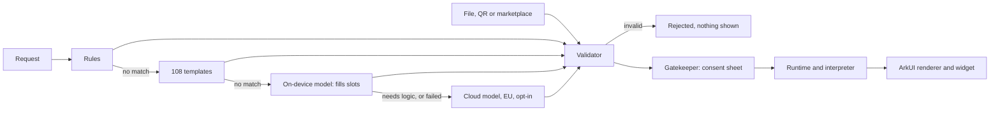
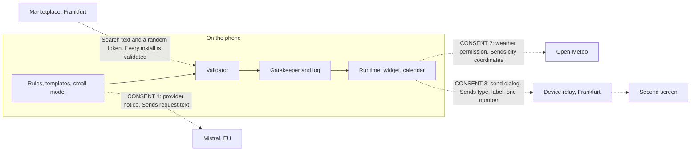
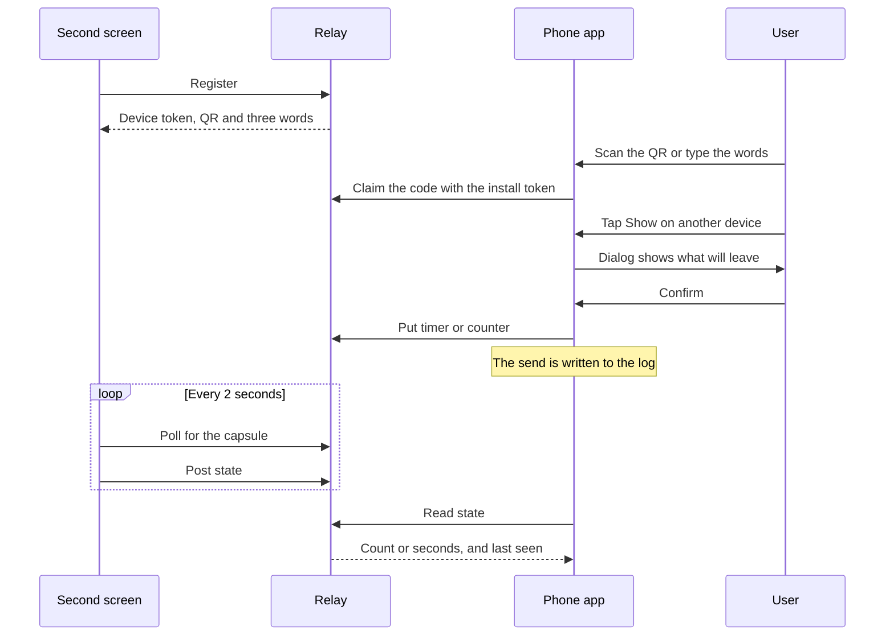
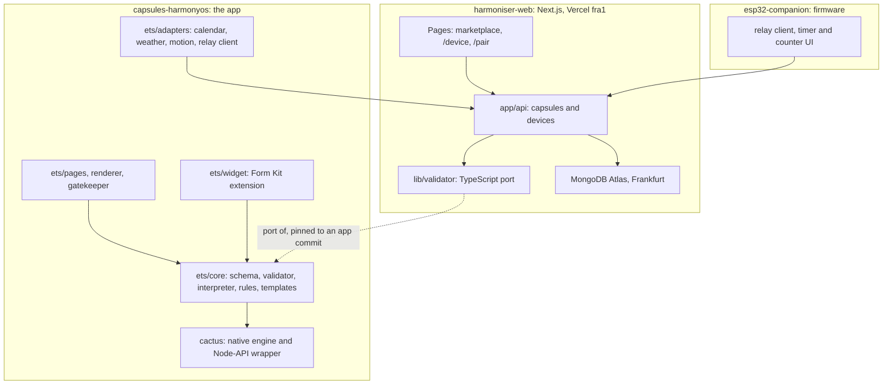

# Jury research and the 5-minute deck: Harmoniser

> AI-assisted desk research (a Claude Code sub-agent, 2026-10-04, about 03:30). Written from public web sources and from the code and documents of the repositories. Nothing was built or run. Facts carry the tags defined below; line references are to the commit named in the text and will drift. "Local file" means the reader's copy of a repository or of the track PDFs, which are not all in this repository.
>
> **Corrections made when this file was added to the repository:** demo beat A1 said "Tick one task"; the list-plus-weather capsule can add tasks but not tick them off, so it now says to add one. Opening note 2 says no record was found of the combined sentence being run on the emulator; the author's check is recorded in a comment on PR #14, and it was not re-run. PR #13 was still open when this was written.


**Written:** Sunday 4 Oct 2026, about 03:30. Submission 11:00. Finalists announced 15:00. Pitches about 16:00.

**How this was produced:** AI-assisted desk research (a Claude Code sub-agent). Read-only on every repository. Nothing was built or run. App repo read at `origin/main` `b54cbfe` (PRs #12, #14, #15, #16 are merged; #13 is open). Web facts were fetched on 4 Oct 2026 with a search tool; a fact marked *verified* was read on the page named this session.

**Tags**

| Tag | Meaning |
| --- | --- |
| **[V]** | Verified this session at the URL given |
| **[V-local]** | Read this session in a local file (track PDFs, the cloned challenge repo, the app repo) |
| **[B]** | Taken from `PITCH_BRIEF.md` or another team document, not re-checked |
| **[M]** | From memory. Check before saying it |
| **[I]** | My inference |

**Three things that changed since `PITCH_BRIEF.md` was written. Read these first.**

1. **Four capsule permissions are enforced on main, not one:** reminders, motion, battery, weather (`PERMISSIONS_AND_MAPS.md` §0, §1.5) [V-local]. The schema now has 8 permission names, and the app declares 5 OS permissions (ACCELEROMETER added). Brief lines 129, 598, 611, 612 are out of date.
2. **The judges' request has a rule now.** PR #14 "one prompt for a task list + the weather" and PR #15 (phrase tests) are merged (`22964da`, `a976ff7`) [V-local]. The README records `weather in Kraków` working on the emulator on 4 Oct. I found no record of the *compound* sentence being run on the emulator. Run it before saying "fixed".
3. **PR #16 is merged** (`b54cbfe`: "skip marketplace search in on-device-only mode") [V-local]. The change is in `CapsuleGenerator.ets`, the create path. See the wording rule in Part 2 §2.

---

# Part 1. Who is judging, and what they have rewarded

## 1.1 The track

### Who runs it

| Fact | Source | Tag |
| --- | --- | --- |
| Organiser of the challenge is **Huawei Polska sp. z o.o.**, Warsaw. Huawei writes the rules, evaluates and picks winners. PROIDEA runs the event and "does not participate in the substantive evaluation" | `tracks/Partner Task [Huawei] .../RULES Imagine What_s Next.pdf` §1 | V-local |
| "Solutions will be evaluated by a Jury appointed for the Huawei Challenge." Each juror scores each criterion 1 to 10. Final score is the weighted average across jurors. "The Jury may invite selected teams to present or demonstrate their solutions." | Same PDF §5 | V-local |
| A prize may be withheld if the solution does not reach 50% of the maximum score | Same PDF §5 | V-local |
| Prize pool PLN 25,000; 1st PLN 12,000; 2nd PLN 8,000 | Same PDF §6; https://www.facebook.com/HackYeahPL/posts/%EF%B8%8F-huawei-challenge-imagine-whats-nexthuawei-invites-hackyeah-2026-participants-t/1703399571788550 | V-local, V |
| Huawei may invite teams "whose solutions are of particular interest" to talk about promotion in the HarmonyOS ecosystem, technical collaboration or licensing | Same PDF §7 | V-local |
| Disqualification grounds include "provides false or misleading information" | Same PDF §8 | V-local |
| The public challenge repo is `onirodeveloper/hackyeah2026-challenge`, one commit, 1 Oct 2026 17:29 +0200, author `onirodeveloper` | Cloned this session | V-local |
| "Repositories may undergo an automated technical pre-review; the final assessment is made by the jury." | `hackathon_challenge.md`, last line of the criteria | V-local |
| HackYeah posted that the Huawei challenge is "at Oniro booth" | https://www.facebook.com/HackYeahPL/ (post title in search results) | V (title only) |

### People named in public material

Only one person is named in connection with this track.

- **Paweł Mandes, Huawei.** Named on slide 1 of the workshop deck (`presentation/Huawei Hackathon Challenge Workshop.pdf`) [V-local, read from the slide image] and as the speaker of "[ENG] [Task Teaser] Huawei: Imagine What's Next", Saturday 12:00 to 12:45, SoftSkills track [V] https://hackyeah.pl/conference-agenda. His SFSCON speaker page calls him "an active open-source contributor, most notably to the Eclipse Foundation's Oniro for OpenHarmony" [V] https://www.sfscon.it/speakers/pawel-mandes/. He gave "Introduction to mobile app development for Oniro/OpenHarmony OS" at SFSCON 2025 [V] https://www.sfscon.it/programs/2025.
- **He is named as the presenter, not as a juror.** No jury list and no mentor list for this track is public. `hackyeah.pl/mentors` loads its list with JavaScript and returned no names to the fetch tool [V, empty]. Do not guess who sits on the jury.

What this tells you without guessing about anyone [I]: the people who wrote the material are engineers who work on app development for Oniro and OpenHarmony. Expect questions about code, kits and build steps, not about market size.

### What the track says it wants

All from `hackathon_challenge.md` and the criteria PDF (same text) [V-local].

- "an innovative system feature or mobile application for an OpenHarmony-based mobile device"
- Three areas: **Intelligent Experiences** ("agents, contextual awareness, personalization, intelligent interaction and on-device AI"), **Spatial Experiences**, **Human-Centric Technology** ("accessibility, digital wellbeing, inclusive design, education, cultural experiences and responsible technology"). "Many of the best ideas sit across more than one."
- "The final solution should demonstrate clear value, a functional implementation and innovation that current platforms are missing."
- "Show what a genuinely open mobile platform makes possible when nobody has to ask permission first."
- Must target API 20 or later, run on an emulator or device, and "demonstrate the use or improvement of at least one platform, device or system capability".

### What the track says it does not want

| Statement | Source | Tag |
| --- | --- | --- |
| "An app that would run unchanged on any other OS, without touching anything platform-specific, scores lower here." | Criteria, platform capabilities | V-local |
| "an Android, iOS, web or desktop build alone is not sufficient" | Technical requirements | V-local |
| "We value a working, narrow solution to a real problem over a broad concept that only exists on slides." | Criteria, usefulness | V-local |
| "Build something new - don't recreate what already exists or simply port a solution from another platform" | Workshop slide 13 (OCR, then read) | V-local |
| "Pick one capability and make it work end to end. Breadth reads as unfinished." | Workshop slide 19 (read from the image) | V-local |
| "Say plainly what is real and what is faked. Simulated sensor data is fine if you declare it." | Workshop slide 19 | V-local |
| "Record the demo before you are out of time, not after." | Workshop slide 19 | V-local |
| "Write the README as you go. Reproducibility is a judging criterion and it is the easiest one to lose." | Workshop slide 19 | V-local |
| "Pick the category your project leads with and make that choice explicit in your submission." | Workshop slide 8 | V-local (OCR) |
| "Are the components, data flows and integrations justified, not added for show?" | Criteria, technical execution | V-local |
| "no secrets in the repo, input validation, no unnecessary permissions or risky dependencies" | Criteria, technical execution | V-local |

**The biggest risk for Harmoniser is the "breadth reads as unfinished" line.** The project has rules, templates, an on-device model, a cloud model, widgets, a marketplace, a relay and firmware. The pitch has to present one capability end to end (sentence, validated capsule, consent, real system service) and treat everything else as evidence for it. [I]

### The story Huawei told in the workshop

From the workshop deck, slides 2 to 7 [V-local, OCR; check the slide before quoting].

- Slide 2, "Why do we need another mobile operating system": digital sovereignty; "The existing Android/iOS duopoly creates dependency"; "Governance matters as much as source availability".
- Slide 3: "The next wave is multi-device, embedded and context-aware"; "Devices form ecosystems that work together, not isolated gadgets"; "the right information at the right moment - smart notifications, not noise".
- Slide 4: "Your prototype is evidence: it shows what the open stack already delivers and exposes what still needs work".
- Slide 5: "One stack, three governance models - code built on the open layer also runs on HarmonyOS".
- Slide 7: "50+ million HarmonyOS 5 & 6 devices", "10+ million registered developers" (OCR of a figures slide; do not quote the numbers).
- Slide 9: minimum API 20; "HarmonyOS 6.1.1 -> API 24, HarmonyOS 7 -> API 26"; "Oniro is an emerging distribution, currently based on OpenHarmony 6.1.0 and still taking shape".

Two phrases from that deck are worth echoing because they are true of Harmoniser: "the right information at the right moment" (a capsule on the home screen) and "exposes what still needs work" (your list of four things you would need from Huawei, brief Q65).

### Oniro, OpenHarmony, HarmonyOS

| Name | What it is | Source | Tag |
| --- | --- | --- | --- |
| OpenHarmony | "an open-source project incubated and operated by the OpenAtom Foundation" | https://projects.eclipse.org/projects/oniro.oniro4openharmony | V |
| Oniro | "an Eclipse Foundation Project dedicated to the development of an open source vendor-neutral Operating System (OS) platform", "established through a collaboration between ... The Eclipse Foundation and The OpenAtom Foundation" | https://oniroproject.org/ | V |
| Eclipse Oniro for OpenHarmony | "built upon the foundational layers of OpenHarmony"; "extends OpenHarmony code base with add-ons for the European and Global markets, such as ReactNative support, Eclipse Theia based IDE, Servo web engine" | https://projects.eclipse.org/projects/oniro.oniro4openharmony | V |
| Oniro distribution | "primarily intended for the European market" | https://www.eclipse.org/collaborations/working-groups/oniro/charter/ | V |
| HarmonyOS | "Huawei's own product, and it is proprietary", built on OpenHarmony | `hackathon_challenge.md` | V-local |
| HarmonyOS NEXT | The generation with the Android (AOSP) code removed; announced at HDC 2023 | https://www.huaweicentral.com/cutting-ties-with-android-harmonyos-next-is-ready-to-release-native-harmonyos-app-ecosystem | V (trade press) |

A third-party explainer puts the caveat well: "there is no guarantee that a HarmonyOS app will run as-is on an OpenHarmony device" and "Kits expose device capabilities; some are HarmonyOS-only" (the second is Huawei's own workshop slide 14) [V] https://comcomponent.com/en/blog/openharmony-vs-harmonyos-explained/, [V-local]. **This matters for Harmoniser:** the app targets HarmonyOS and leans on HarmonyOS SDK kits (Calendar, Core Vision, Scan, Share). Nobody checked it on OpenHarmony or Oniro (brief Q28).

### Huawei's stated direction in Europe and abroad

| Statement | Source | Tag |
| --- | --- | --- |
| HarmonyOS "is heading beyond Asia" and Oniro gives European companies control | `hackathon_challenge.md` | V-local |
| At the HarmonyOS Ecosystem Conference, 28 to 29 Aug 2026, rotating chairman Xu Zhijun said Huawei will run HarmonyOS pilot programmes in selected countries and regions, and aims to "provide the world with a second option" | https://www.huaweicentral.com/huawei-is-finally-thinking-of-global-harmonyos-expansion ; https://uz.kursiv.media/en/2026-08-30/huawei-prepares-global-harmonyos-rollout-as-ecosystem-tops-400000-apps | V (trade press, two outlets) |
| Xu named international expansion as one of two major challenges, the other being AI-era capabilities | Same kursiv article | V (trade press) |
| A Huawei director says the Eclipse and OpenAtom partnership exists "to make OpenHarmony compatible with the global market" | https://oniroproject.org/documents/oniro-prospectus.pdf | V |

I found no page for a named "Huawei European developer programme" for HarmonyOS. The European "Huawei Developer Competition" is a Huawei Cloud contest (see 1.2). Say "Huawei's push outside China", not a programme name.

### Public statements about this track

- HackYeah, Facebook: "Huawei invites HackYeah 2026 participants to explore the future of digital experiences and take on a challenge built around the HarmonyOS ecosystem ... create an innovative solution for mobile devices that demonstrates the potential of a new generation of operating systems." [V] (URL above)
- HackYeah, Facebook: "Huawei joins HackYeah 2026 as a Task Partner" [V, title only].
- I found no LinkedIn or X post by Huawei, Oniro or Eclipse about this track. The Oniro X account shows no posts to a logged-out reader [V] https://x.com/Oniro_Project.

---

## 1.2 Past editions and comparable contests

**Plainly: very little is public, and nothing is public for a HarmonyOS app hackathon in Europe.**

| Contest | What I found | What it tells you | Tag |
| --- | --- | --- | --- |
| HackYeah 2025 | Tasks listed in the organiser's write-up: gamedev, defence, biohacking, travel, Journey Radar (Małopolska), #Prompt2Code2 (KNF), ZUS tasks, CTF. No Huawei task named. https://hackyeah.pl/hackyeah-2025-a-hackathon-that-turns-ideas-into-reality | Huawei was not a task partner in 2025, as far as the write-up shows | V (absence, not proof) |
| HackYeah 2024 | Winners page lists open tasks; the excerpts I read show no Huawei task. https://2024.hackyeah.pl/winners-2024 | Same | V (partial page) |
| HackYeah 2026 | "Huawei joins HackYeah 2026 as a Task Partner" | This looks like the first Huawei track at HackYeah [I] | V (title) |
| Huawei Developer Competition Europe 2022 | A Huawei Cloud contest: "create industry-transforming innovations using HUAWEI CLOUD"; 9 finalists "pitch live in front of a Huawei jury panel". https://www.agorize.com/en/challenges/europe-huawei-developer-competition-2022 | Cloud, not HarmonyOS. Format precedent only: finalists pitch live to a Huawei panel | V |
| Huawei Tech Arena Poland 2024, 2025 | University algorithm contests (2024: approximate nearest neighbour search; 30 universities, 61 teams). "Selected teams will pitch live in front of a Huawei Jury Panel"; internships offered. https://huawei.agorize.com/en/challenges/2025-poland-tech-arena | Huawei Poland runs technical contests and judges on engineering merit. Not an app contest | V |
| Apps UP 2022 (Huawei Global App Innovation Contest) | HMS-era app contest with an "All-Scenario Coverage Award" and a "Best HMS Innovation Award". https://www.bemyapp.com/events/huawei-global-app-innovation-contest.html | Award names reward multi-device coverage and use of Huawei services. Winners not found | V |
| HarmonyOS Innovation Contest (China) | Huawei: it "encourages developers to ... develop cross-device HarmonyOS applications and atomic services". https://www.huawei.com/en/sustainability/the-latest/stories/win-win-development/developer-competitions | The stated aim names cross-device apps and atomic services | V |
| HarmonyOS Innovation Contest 2025 winners | A 36Kr brand article (promotional, not judge commentary) describes several. https://eu.36kr.com/en/p/3599075116187912 | See the table below | V (sponsored content) |
| Oniro hackathons | The Eclipse newsroom lists a "HackaTUM" item under the Oniro tag, with no results. https://newsroom.eclipse.org/tags/oniro | Oniro has appeared at student hackathons. No winners published | V (title only) |

**Winners described in the 36Kr article** [V, promotional source]:

| Winner | What it used | 
| --- | --- |
| Sohu News | "deeply integrated the HarmonyOS Form Kit and placed core functions ... directly on the desktop"; Vision Kit text recognition linked to the schedule; Share Kit "Tap-to-Share" |
| MiGu Music | Atomic ("meta") services for "click-and-use"; the distributed soft bus so "music follows the user" |
| DuoLe Guandan | The "Tap-to-Connect" near-field function to form a team |
| Caiyun Weather | The graphics pipeline, radar maps drawn over the map |
| PromptTuner | Huawei account login, dark-mode framework |

The article's own summary of "winner rules": a high "HarmonyOS content", meaning system-level capabilities used with purpose; services reachable without opening the app (widgets, atomic services); cross-device by design; AI as part of the system, not an add-on.

**Patterns, and how strong the evidence is** [I]:

- **Service widgets and Form Kit:** rewarded in the one write-up I have. Harmoniser's strongest overlap. Sohu News used Form Kit, Vision Kit and Share Kit, the same three kits Harmoniser uses.
- **Distributed and multi-device:** named in the contest's stated aim and in two winners. Harmoniser does **not** use the distributed APIs.
- **Atomic services:** named in the contest's aim and in one winner. Harmoniser does **not** ship one.
- **On-device AI, accessibility, privacy:** named in this track's own themes. I found no past-winner evidence for or against.
- All of this comes from a Chinese consumer contest described by a paid article. Treat it as vocabulary the jury knows, not as a scoring rule.

No published judge commentary was found for any of these contests.

---

## 1.3 Huawei's vocabulary, and how Harmoniser honestly relates

"Supports" means the code uses it. "Adjacent" means the idea is related and the code does not use it. "Does not use" means say so if asked.

| Term | What it is, in one sentence | Source | Harmoniser | What to say |
| --- | --- | --- | --- | --- |
| HarmonyOS NEXT, "pure HarmonyOS" | The HarmonyOS generation without Android code, where apps are native. | huaweicentral 2023 (URL above) [V, trade press] | **Supports.** Native ArkTS and ArkUI, Stage model, min API 20, target API 24 [B] | "A native HarmonyOS app. There is no Android or web build of it." |
| HarmonyOS 6 | The 2025 release; this track's minimum (API 20). | Workshop slide 9 [V-local]; https://technode.com/2025/06/20/huawei-launches-harmonyos-6-developer-beta-version-at-hdc-2025/ [V] | **Supports** (min API 20) | State the API levels only |
| HarmonyOS 7 | Announced at HDC on 12 June 2026, built around agents; API 26 per the workshop slide. | https://www.huaweicentral.com/huawei-harmonyos-7 [V, trade press]; slide 9 [V-local] | **Does not use.** Target is API 24 | Do not mention unless asked |
| HMAF, the agent framework | Introduced with HarmonyOS 6. TechNode expands it as "HarmonyOS Multi-Agent Framework"; other outlets write "HarmonyOS Agent Framework". Version 2.0 in HarmonyOS 7 has "intent as a service". | TechNode (above) [V]; https://www.huaweicentral.com/huawei-has-redesigned-harmonyos-7-for-agentic-ai-chairman [V, trade press] | **Does not use.** Brief §5.10: Agent Framework Kit starts agents published on the Celia platform, Chinese mainland only [B] | "We do not use the agent framework. A capsule has a fixed action list and declared permissions, so it is the kind of thing an agent could hand a user. That is a next step, not a claim." Say "the agent framework", not an expansion of the acronym |
| Intents Kit, intent framework | Lets an app share intents with the system so Celia can suggest them. | Brief Q36, Q63 [B] | **Does not use** | Brief Q36 |
| Harmony Intelligence, Celia (Xiaoyi) | Huawei's system AI and its assistant; a system-level agent in HarmonyOS 7. | https://www.huaweicentral.com/huawei-has-redesigned-harmonyos-7-for-agentic-ai-chairman [V, trade press] | **Does not use** | "Celia suggests existing services. We let the user make one." (brief Q55) |
| Atomic services | Installation-free apps, tied to a HUAWEI ID, using only the Atomic Service API set. One bundle at most 2 MB, all bundles at most 10 MB (20 MB on application). | https://developer.huawei.com/consumer/en/doc/atomic-guides-V5/atomic-service-definition-V5 and https://developer.huawei.com/consumer/en/doc/atomic-guides-V5/atomic-service-package-basics-V5 [V] | **Does not use.** `installationFree: false`; the engine alone is 2.5 MB stripped [B] | Brief Q30. Never say "supports atomic services" |
| Service widgets (Form Kit) | Cards on the home screen that show and act on app content without opening the app. | Brief §6 [B]; the atomic service page shows widgets as an entry point [V] | **Supports.** FormExtensionAbility, 2x2 and 2x4, two-process state, taps go through the gatekeeper [B] | This is your strongest platform point. Lead with it |
| 1+8+N | Huawei's device strategy: the phone at the centre, eight device types around it, and an IoT layer. | The atomic service page says services "can run on 1+8+N devices" [V]; https://consumer.huawei.com/ae-en/community/details/topicId-145011 (community post) [V] | **Adjacent.** Phone only (`deviceTypes: phone`). The relay is our own HTTPS service | Brief Q62. Do not list the eight types |
| Super Device, distributed soft bus | System features that make nearby devices act as one. | 36Kr article (above) [V, promotional] | **Does not use.** The emulator cannot test distributed features (`README.md` capability table in the challenge repo) [V-local] | Brief Q27. Never say "distributed" or "Super Device" about the relay |
| Core AI kits | Core Vision Kit (OCR and more) and Core Speech Kit, on the device. | Brief §5.10, §6 [B] | **Supports, narrowly.** Core Vision OCR in the photo path. Core Speech in core code only, no button | "We use the system OCR. Our language model is not a Huawei kit." No claims about reading photos beyond OCR text |
| MindSpore Lite Kit | Huawei's on-device tensor runtime for `.ms` models. | Brief §5.10 [B] | **Does not use** | Brief §5.10: what a port would take |
| Star Shield | The HarmonyOS NEXT security architecture; press reports it blocks nine kinds of unreasonable permission and checks apps at install. | https://www.huaweicentral.com/huawei-unveils-harmonyos-next-star-shield-security-for-better-privacy-protection [V, trade press] | **Adjacent in aim, unrelated in mechanism.** The gatekeeper is application-level policy inside our process [B] | "Same aim, a lower layer. Ours is not an OS feature and not a sandbox." Do not say "Star Shield" first |
| Tap-to-Share | Tap two devices to share. | 36Kr; TechNode [V] | **Does not use** | Do not mention |
| App ecosystem outside China | Pilot programmes abroad; "a second option". | huaweicentral, kursiv (above) [V, trade press] | **Adjacent.** A marketplace whose listings can be checked mechanically | Brief Q64, with the 108-of-115 caveat |
| Digital sovereignty, open stack | The track's framing for Europe. | `hackathon_challenge.md` [V-local] | **Partly.** EU cloud by default, Frankfurt hosting, on-device first. But the app targets proprietary HarmonyOS kits and was not checked on Oniro | "Our data choices are European by default. We have not run it on Oniro." |

---

## 1.4 What technical juries reward and punish in short pitches

| Point | Source | Tag |
| --- | --- | --- |
| A demo video "should be a demo of their hack, not a presentation" | MLH organiser guide, https://guide.mlh.com/general-information/judging-and-submissions/judging-plan | V |
| "The demo video gives the most amount of scope ... our first indicator of how much time was invested"; "Presentation and storytelling matters" (judges quoted by Devpost) | https://info.devpost.com/blog/hackathon-judging-tips | V |
| Start with the pitch and a quick overview; "judges will likely review multiple projects back to back" | https://info.devpost.com/blog/6-tips-for-making-a-hackathon-demo-video | V |
| "Keep it short, interesting (no slide shows/decks), and visually engaging"; "Address how it meets the judging criteria" (past winners quoted by Devpost) | Same | V |
| Time split for a 3-minute slot: 30 s problem and solution, 90 s demo, 30 s stack, 30 s next | AngelHack, https://angelhack.com/blog/10-tips-to-help-you-rock-your-next-hackathon-demo/ | V |
| "Name your model and how you evaluated it ... telling judges you used a large language model gives them nothing to score" | Same | V |
| "The hardest engineering decision gets named out loud" | Same | V |
| "Record a clean run of your demo the night before, save it locally, and swap in local fixtures for anything that depends on a network call" | Same | V |
| Judges tend to ask: "who the user is, who pays, what was real versus mocked, and what you'd build next" | Same | V |
| Checklist: demo data seeded, URL bookmarked, slow steps pre-loaded, notifications off, sleep disabled, font size checked, timer visible | Same | V |
| "A legible idea can be understood by people who know nothing about your business"; being concise "shows me that you are efficient" | Y Combinator, "How to Pitch Your Startup" (transcript), https://www.ycombinator.com/library/6q-how-to-pitch-your-company | V |
| Do not describe yourself as "X for Y" using a smaller company | Same | V |
| HackYeah's own finalist guidance: explain the problem, show what you built, explain how it works, why it stands out, what you achieved during HackYeah; "Presentations aren't recorded"; AI tools and open-source libraries "must be named in the final presentation" | `hackyeah-2026-guide-EN.md` p.23 and FAQ 5 | V-local |

I could not get usable text from Junction or HackMIT guides in the time available. The AngelHack and Devpost pages are organiser guides, not judge memoirs.

**Applied to five minutes** [I]: 25 s to say what it is, about 110 s of live product, 40 s on how it works and the hard part, 30 s on evidence and limits, 30 s on next steps, 10 s to close. For a failed demo: stop talking about the failure, say one sentence, play the recording, keep narrating. In Q&A: answer in two sentences, give the number, say "not built" plainly, hand to the owner of the topic.

---

## 1.5 The 15 questions this jury is most likely to ask

Reason tags: **[stated]** in their materials, **[pattern]** from past winners, **[inference]**.

| # | Question | Why | Answer in `PITCH_BRIEF.md` |
| --- | --- | --- | --- |
| 1 | "Last night we asked for a task list with the weather. Does it work now?" | [stated] It is their own request (brief §5.8) | Q66, **with the update in the box below** |
| 2 | "What here would not run unchanged on Android or iOS?" | [stated] criteria: "would run unchanged on any other OS ... scores lower" | Q34, §6 table |
| 3 | "Do you use distributed features? Is the second screen Super Device?" | [stated] criteria name "distributed features"; [pattern] | Q27, Q31, Q69 |
| 4 | "Why your own engine and not Huawei's on-device AI or the agent framework?" | [stated] criteria: "on-device AI and agent frameworks" | §5.10, Q36, Q20 |
| 5 | "Does it run on OpenHarmony or Oniro?" | [stated] the track is run from the Oniro side | Q28 |
| 6 | "What happens when the model is wrong?" | [stated] criteria: "if you use AI models, incorrect model output" | §5.6, Q4, Q68 |
| 7 | "What is real and what is faked? Is the board a watch?" | [stated] workshop slide 19 | Q69, Q73, §8 table |
| 8 | "What did AI write? What was built here, and what before?" | [stated] criteria on transparency; rules §4 | Q70. **Second half not covered, see below** |
| 9 | "Can we build and run it from the README? On our emulator?" | [stated] criteria on reproducibility; "automated technical pre-review" | Q35. **Partly covered, see below** |
| 10 | "Who uses this, and which theme do you lead with?" | [stated] criteria on usefulness; slide 8 | Q48, Q49. **Theme not covered, see below** |
| 11 | "Isn't this templates with an LLM on top?" | [inference] 108 templates and 7 rule parsers | Q67 |
| 12 | "Which of your permissions actually do anything? Is there a sandbox?" | [stated] criteria: "no unnecessary permissions"; [inference] | Q2, Q74. **Permission count is out of date, see below** |
| 13 | "Why is this not an atomic service or a service widget from Celia?" | [pattern] atomic services and widgets in past winners | Q30, Q55 |
| 14 | "What leaves the phone, and where does it go?" | [stated] sovereignty framing; criteria: "data handling" | Q37, Q38, §5.5 |
| 15 | "You built a lot. Which one thing works end to end?" | [stated] slide 19: "Breadth reads as unfinished" | **Not covered, see below** |

### Drafted answers for what the brief does not cover

Every sentence below uses facts already in the brief, the README or `PERMISSIONS_AND_MAPS.md`. No new claims.

**Q1 update.** "It failed for two reasons, both ours. Capsules had no live data, and the request fell to the small model, which made a checklist out of your words. Overnight we added a weather reading behind its own permission and a rule that builds the list and the weather in one capsule. *[Only if you ran it on the build you are showing:]* You can try the same sentence now."

**Q8, second half.** "We started from the HackYeah template: an empty ArkTS project and the agent instruction files. Everything else was built here, and the commit history shows it: the first commit is Saturday 14:59. The third-party parts are the Cactus engine and the LFM2 model, both listed in `docs/THIRD_PARTY.md`."

**Q9.** "The README has setup, build, install and test steps, and the unit tests run from one command. Three honest limits: it was checked only on the Apple Silicon DevEco emulator, the native library is arm64 only, and the live marketplace and the cloud model need a small config file that is not in the repo. Without that file the app still builds and runs rules, templates and the 108 shipped examples."

**Q10, theme.** "We lead with Intelligent Experiences: a sentence becomes a working tool, on the device first. The second theme is Human-Centric, responsible technology: nothing a model wrote is executed, and each capsule asks before it uses anything."

**Q12, permissions.** "Four are enforced end to end today: reminders, the motion sensor, battery and weather. Deny one and that part of the capsule is shown as blocked and the attempt is written to the log. Weather is the only one that sends anything off the phone, and it sends only a city's coordinates. Notifications is checked but not delivered yet, and the other names in the schema are reserved and do nothing. It is not an OS sandbox; it is policy inside our app." (`PERMISSIONS_AND_MAPS.md` §1.5)

**Q15.** "One thing: you type a sentence, you get a capsule that is data, one validator checks it, a consent sheet asks per permission, and what you allow reaches real system services, the calendar and a home-screen widget. The model, the marketplace and the second screen are other ways into that same path or out of it. They all pass the same validator and the same consent."

---

# Part 2. The 5-minute pitch

## 2.0 Before anything else

**Speakers.** Ash: app owner. Lewis: web and marketplace owner. Keanu: devices and research owner.

**Rules for every spoken line** (from the brief's "do not say" notes and the task):

| Do not say | Say |
| --- | --- |
| "a wrist permission", "the wrist is a permission" | "Each send to another device is confirmed in a dialog and written to the log." |
| "watch", "HarmonyOS wearable" about the board | "An ESP32 board standing in for a watch. It does not run HarmonyOS." |
| "nobody has done this" | "Nothing's Essential Apps is the closest thing. Ours differs in three ways." |
| "the model builds the app" | "The small model picks a kind and fills in values. Code builds the capsule." |
| any accuracy figure other than the measured one | "9 of 15 on its own, 11 of 15 with rules in front, in our own small test on the emulator." |
| "nothing leaves the phone" as a blanket | "In on-device-only mode, creating a capsule sends nothing off the phone." PR #16 is merged, so this is allowed. It is about *creating*. A weather capsule you allow still fetches weather, and a send to a second screen still sends |
| "reads photos", "understands images" | Nothing. Vision is off. Leave photos out of the pitch |
| "sandboxed", "GDPR-compliant", "distributed", "Super Device", "supports atomic services" | See brief Q2, Q38, Q27, Q30 |
| "100 tokens a second on the phone" | Emulator figure on an M4 Pro. Phone speed is not measured |
| "fixed" about list plus weather | Only after watching it work on the build on stage |
| "115 community capsules" | "Over 100 listings, 108 of them examples we made." |

**Three checks to do before 15:00.** Each decides a demo beat.

1. Type `a task list and the weather for Kraków` on the stage build three times. If it does not give a list and live weather each time, use beat order B below.
2. Pair the app with `harmoniser.keanuc.net/device` on the stage build and send a timer, three times. The README still says the app "was checked on the emulator only with [the] simulation". If it fails once, the second screen is shown from the recording only.
3. Record the whole demo once it works. Save it on the presenting laptop and on a phone. Venue Wi-Fi is the single point of failure for weather, the marketplace and the relay.

## 2.1 Time plan

Criteria, quoted from the rules §5: "originality – 20%; demonstrated usefulness of the proposed solution – 20%; technical execution – 20%; use or enhancement of platform capabilities – 20%; quality of the demonstration – 10%; reproducibility and transparency of the development workflow – 10%."

Short codes: **O** originality, **U** usefulness, **T** technical execution, **P** platform, **D** demonstration, **R** reproducibility.

| Time | Length | Slide | On screen | Speaker | Serves |
| --- | --- | --- | --- | --- | --- |
| 0:00–0:25 | 25 s | 1 | Title slide with one screenshot: a capsule widget on the home screen | Ash | U 20% |
| 0:25–0:50 | 25 s | 2 | The bill-split capsule JSON next to its rendered capsule | Ash | O 20% |
| 0:50–2:40 | 110 s | 3 | **Live emulator**, full screen. Keanu's second screen beside it for the last beat | Ash drives and talks; Keanu speaks the second-screen beat | D 10%, U, P, T |
| 2:40–3:15 | 35 s | 4 | Pipeline diagram | Ash | T 20% |
| 3:15–3:40 | 25 s | 5 | Kit table with one line each | Ash | P 20% |
| 3:40–4:05 | 25 s | 6 | Marketplace page and the trust-boundary diagram | Lewis | T, U |
| 4:05–4:30 | 25 s | 7 | Two columns: real, not yet. Test counts. "Built with" line | Keanu | R 10%, T |
| 4:30–4:52 | 22 s | 8 | Roadmap, three rows | Keanu | P, O |
| 4:52–5:00 | 8 s | 8 | Same slide; repo address and QR | Ash | all |

About 60% of the time is on things the four 20% criteria score, shown working. The two 10% criteria get the demo itself and slide 7.

### The live demo, beat by beat (110 s)

**Order A** (use only if check 1 passed three times):

| Beat | Time | Action | Line |
| --- | --- | --- | --- |
| A1 | 0:50–1:30 | Type `a task list and the weather for Kraków`. Create. Consent sheet opens with Weather off. Leave it off, Run: the weather part is drawn as blocked. Open the log. Go back, allow Weather: the weather line appears with the Open-Meteo credit. Add one task (tasks can be added, not ticked off) | See slide 3 lines |
| A2 | 1:30–2:05 | Type `pasta 9 min, sauce 15 min, bread 6 min`. Create, allow Reminders, start. Press Home: the widget counts down. Tap + or start on the widget | See slide 3 lines |
| A3 | 2:05–2:40 | Open the pasta capsule, **Show on another device**, the dialog shows exactly what will be sent, Send. The browser tab (or the board) counts down. Open the log | Keanu speaks |

**Order B** (check 1 failed): start with A2, then do the deny-and-allow on the pasta capsule's Reminders (the same gatekeeper story, verified on the emulator), then A3. Do not type anything close to the judges' sentence. If they ask, use the Q1 answer without the last sentence.

**If check 2 failed:** replace A3 with the marketplace: search `squat`, Install, the consent sheet reads "From the marketplace", Run. Keanu then plays the 10-second recorded clip of the board.

### Recorded fallback: exactly when to switch

Lewis holds the recording, open and paused, on a second window, with these timestamps written on the cue card: start of A1, start of A2, start of A3.

Switch to the recording when any one of these happens:

1. **Before 0:50:** the emulator is not on the projector, or the app is not on its home screen. Play the recording from the start.
2. **A step shows no result within 8 seconds** of the tap (count it silently). Ash says: "The network is slow here, so here is the same step recorded this morning." Lewis plays from that beat's timestamp. Ash keeps narrating over it.
3. **Any error card or crash.** Same sentence, same switch. Do not retry on stage.
4. **The clock reaches 2:40** with the demo unfinished. Ash says "The rest is in the recording in the repo" and moves to slide 4. Do not play the recording; there is no time.

Never switch back to live after switching to the recording.

## 2.2 Deck outline (8 slides)

On-slide text is the whole text on the slide, 12 words at most. Titles are claims.

### Slide 1. One sentence in, a small working app out

- **Visual:** a phone home screen with one Harmoniser widget counting down three timers.
- **On slide (9 words):** "Harmoniser. One sentence in. A small working app out."
- **Ash:** "You need three kitchen timers tonight. You do not want another app with ads and an account. In Harmoniser you type one sentence and get a small app we call a capsule. It runs on HarmonyOS, it can sit on your home screen, and it can use only what you allow."

### Slide 2. The model writes data, never code

- **Visual:** left, 12 lines of the bill-split capsule JSON; right, the capsule it draws.
- **On slide (10 words):** "A capsule is data. The validator checks all of it."
- **Ash:** "This is the idea. AI app builders generate code. We generate data. A capsule is a JSON document with a fixed set of components and a small expression language with no loops and no network. So one validator can check everything a capsule can do before it runs. Nothing a model wrote is executed."

### Slide 3. Live: the request you gave us last night

- **Visual:** the live emulator. The slide is only a title bar.
- **On slide (9 words):** "Live: a task list and the weather for Kraków"
- **Ash, A1:** "Last night you asked for a task list with the weather. It failed. Capsules had no live data. Here is the same request now. This is the consent sheet. Everything starts off. I leave weather off. The list works, the weather is blocked, and the block is in the log. Now I allow it. It sends the city's coordinates to Open-Meteo and nothing else."
- **Ash, A2:** "A common request needs no model. Three timers, built by rules on the phone. I allow reminders. The timers are events in the system calendar. This is the same capsule as a Form Kit widget. A tap on the widget goes through the same permission check."
- **Keanu, A3:** "A capsule can show on a second screen. The phone asks first and shows exactly what will leave: a type, a label and one number. I confirm. This browser tab now runs the timer, and the send is in the log. This board gets the same message. It is an ESP32 standing in for a watch. It does not run HarmonyOS."

### Slide 4. Every source passes one validator and one gatekeeper

- **Visual:** diagram (a) below.
- **On slide (6 words):** "Four sources. One validator. One gatekeeper."
- **Ash:** "A capsule can come from rules, from 108 templates, from a small model on the phone, or from a cloud model in the EU that you opt into. Capsules from other people arrive by file, QR code or our marketplace. All of them go through the same validator, then the same consent sheet. The validator rejects unknown fields and undeclared permissions and type-checks every expression. The hard part was the small model. Asked to write a whole capsule it got 3 of 10. So it only picks a kind and fills in values, and code builds the capsule."

### Slide 5. The product is the HarmonyOS integration

- **Visual:** a two-column table: kit, what it does here. Form Kit: widgets. Calendar Kit: timers as events. Scan Kit: QR import and pairing. Core Vision Kit: on-device OCR. Sensor and battery: shake counter, battery reading. NDK and Node-API: the Cactus port.
- **On slide (10 words):** "Form Kit, Calendar, Scan, Vision, sensors, and our Cactus port"
- **Ash:** "The schema and validator are plain ArkTS and portable on purpose. The product is what surrounds them. Widgets run in a separate process and share state with the app. Timers are Calendar Kit events. Pairing and import use Scan Kit. And the Cactus inference engine had no HarmonyOS build. We cross-compiled it with the OHOS NDK, with three small patches and our own Node-API wrapper. We do not use the distributed APIs or the agent framework."

### Slide 6. A marketplace that can check every listing

- **Visual:** the marketplace page at `harmoniser.keanuc.net`, with diagram (b) small beside it.
- **On slide (8 words):** "No accounts. Server re-validates. Second screen asks first."
- **Lewis:** "The marketplace is live. There are no accounts. Your phone makes a random token and the server stores only a keyed hash of it. The server runs a TypeScript port of the same validator before a capsule is listed, and an installed capsule still goes through your consent sheet. It runs in Frankfurt. Over 100 listings are up; 108 of them are examples we made. The same service relays a timer or counter to a second screen."

### Slide 7. What is real, and what is not

- **Visual:** two columns. Left "Real": rules, templates, validator, gatekeeper and log, calendar, widgets, weather, battery, shake, marketplace, relay. Right "Not yet": phone speed not measured; cloud needs a key file; alerts with the app closed; photos; a real watch. Footer: "Built with Claude Code, OpenAI Codex, Cactus, LFM2-VL-450M, Mistral, Open-Meteo."
- **On slide (10 words):** "Real: listed. Not real: listed. On-device model: 9 of 15."
- **Keanu:** "Here is what is real and what is not. The small model got 9 of 15 in our own test, 11 of 15 with rules in front. That is why everything it says is checked. Speed on a real phone is not measured. AI agents wrote most of the code. We chose the design, approved every schema change and tested on devices. The log is in `AI_WORKFLOW.md`, and the app has about 250 unit tests." *(Say the number the test run prints on the submitted commit. The README records 249 before PRs #14 and #15.)*

### Slide 8. Next: a real watch, more consented data, Huawei's own AI

- **Visual:** three rows, each "what" and "what it takes" (section 2.5).
- **On slide (10 words):** "Next: a real watch, more consented data, Huawei AI kits"
- **Keanu:** "Three next steps. A wearable module that talks to the phone through Wear Engine, in place of our relay. More data behind the same consent, a map next. And Huawei's own on-device AI in place of our engine, once there is a phone API for it."
- **Ash, close:** "Harmoniser: say what you need, see what it may use, and keep it on your home screen. The code, the app package and the tests are at this address. Thank you."

**Optional backup slide 9** (not shown unless asked): the positioning table from section 2.4.

## 2.3 Diagrams

Syntax was checked by reading, not by rendering; no Mermaid CLI was run. Every label is quoted. Paste one into https://mermaid.live before the slide is made.

### (a) Generation pipeline (11 nodes)



Note for the speaker: logic requests go to the cloud first and skip the small model (brief §2, stage 5). The diagram shows the simple-request path.

### (b) Trust boundary: what runs on the phone, what leaves, and when (10 nodes)



Notes: dotted lines cross the network. Marketplace search during *create* is skipped in on-device-only mode (PR #16). Opening the Marketplace tab is the user's own action. Publishing a capsule (the user taps Publish) is not drawn.

### (c) Second-screen relay sequence (4 participants)



### (d) Repository and architecture map (12 nodes)



## 2.4 One-sentence positioning

Each product fact carries its source. Use these only if asked, or on backup slide 9.

| Against | One sentence | Product fact and source |
| --- | --- | --- |
| Apple Shortcuts | "Shortcuts chains actions that apps expose, and you build the chain; Harmoniser makes a small interface with its own state from a sentence." | Apple: "A shortcut is a quick way to get one or more tasks done with your apps. The Shortcuts app lets you create your own shortcuts with multiple steps." [V] https://support.apple.com/guide/shortcuts/welcome/ios |
| KWGT | "KWGT is a manual widget designer with layers and formulas; we generate the widget from a sentence and keep it inside a checked schema." | A how-to describes KWGT's "WYSIWYG-style editor ... with layers, formulas, and interactive elements" [V, third party] https://en.androidayuda.com/create-your-own-android-widgets/ . The Play listing cited in the brief was not re-opened [B] https://play.google.com/store/apps/details?id=org.kustom.widget |
| Widgetsmith | "Widgetsmith lets you style widgets from its own set, such as photos, countdowns and weather; it does not build a new tool with logic." | App Store: "personalize your device ... with a wide range of highly customizable widgets ... showcases your photos, counts down to upcoming events ... check the weather at a glance" [V] https://apps.apple.com/us/app/widgetsmith/id1523682319 |
| Nothing Essential Apps | "It is the closest thing: describe a widget and AI builds it, on Nothing phones; ours is a closed, validated schema with consent per capsule, on-device first, on HarmonyOS." | Play: "Essential Apps is a widget builder for Nothing phones. Describe what you want, and the AI builds it." [V] https://play.google.com/store/apps/details?id=com.nothing.essentialapps . Nothing, Feb 2026: beta on Phone (3); "fully support three permissions. Location, Calendar (read only) and Contacts", with camera, microphone, network fetching and more to come [V] https://nothing.community/d/52739-essential-apps-enters-beta . The Verge after a week: "right now it doesn't deliver" [V] https://www.theverge.com/tech/876229/nothing-essential-ai-app-builder . The brief's "eight or nine tries" figure was **not** re-verified; do not quote it |
| Claude artifacts, ChatGPT canvas | "Those generate code that runs inside a chat product in the cloud; ours is a native ArkUI app on the home screen, built on the phone first, and the model never writes code." | Claude: "You can build artifacts that call Claude directly, turning them into small apps." [V] https://support.claude.com/en/articles/9487310-what-are-artifacts-and-how-do-i-use-them . ChatGPT: "Canvas also now supports rendering React and HTML to create mini apps." [V] https://help.openai.com/en/articles/9930697-what-is-the-canvas-feature-in-chatgpt-and-how-do-i-use-it . How either sandboxes that code is [M]; do not describe it |
| Huawei atomic services | "An atomic service is an install-free app that a developer builds and publishes; a capsule is a few kilobytes of data that a user makes, and it runs inside our installed app." | Huawei: "installation-free applications, that is, Atomic Services"; one bundle at most 2 MB, total at most 10 MB; "Only Atomic Service API set" [V] URLs in 1.3 |
| Huawei service widgets | "Service widgets are made by app developers for their own app; we use the same Form Kit so the user can make the widget." | Form Kit facts from the brief §6 [B]; the atomic service page shows widgets as an entry to services [V] |

## 2.5 The roadmap slide

| Next step | Why it fits Huawei's direction | What it would take | Tag |
| --- | --- | --- | --- |
| **A real watch.** A HarmonyOS wearable module, with Wear Engine carrying the same small message the relay carries today | "Devices form ecosystems that work together" (workshop slide 3) | An approved Wear Engine permission application from Huawei, a Huawei watch, and a watch app that draws a timer and a counter. The message is already small: type, label, one number. Not applied for, not written | [B] brief §7, Q31 |
| **More consented data.** A map next, then others, each as a read-only component with its own permission, the way weather and battery work now | "contextual awareness" (challenge theme); least-permission design | A new `device` binding and permission, a validator rule, a consent row, an adapter. The weather work did this in one night. Map Kit needs a Huawei developer account and an AppGallery Connect setup, so a non-Huawei map source is the faster route (`PERMISSIONS_AND_MAPS.md` §2) | [V-local] |
| **Huawei's own on-device AI.** Replace our engine with a Huawei kit | "on-device AI and agent frameworks" (criteria) | Either a public phone-side LLM API, which we did not find, or MindSpore Lite: export a model to ONNX, convert to `.ms`, write the tokenizer and decode loop in C++ behind the same Node-API surface. The rest of the app does not change, because the model sits behind one interface | [B] brief §5.10 |

**Atomic-service packaging: mention only if asked.** The capsule runtime without the engine could be an install-free viewer for shared capsules. The limits are 2 MB per bundle and 10 MB in total [V], and the engine alone is 2.5 MB stripped [B], so the engine would have to stay out. Nobody measured the app without it. Say "we would have to measure it".

## 2.6 Q&A plan

**Who takes what**

| Topic | Owner | Brief |
| --- | --- | --- |
| Schema, validator, interpreter, gatekeeper, permissions, widgets, rules, templates, on-device model, the Cactus port, the weather failure and fix | Ash | §2–6; Q1–36, Q66–68 |
| Marketplace, tokens, server validation, parity lock, rate limits, hosting, privacy page, scale | Lewis | §7; Q38–41, Q71 |
| Relay, pairing, the board, Wear Engine, model choice research, what is verified, AI workflow, comparisons with other products | Keanu | §7, §5.9; Q27, Q31, Q42, Q47, Q50–55, Q69, Q70 |
| Product, users, roadmap, "what would you need from Huawei" | Ash first, then whoever owns the detail | Q48, Q60–65 |

One person answers. Nobody adds to a teammate's answer unless a fact was wrong.

**Bridge phrase for "we have not done that yet"**

> "Not built. Today it does *[the nearest real thing]*. To get there it needs *[the one concrete step]*."

Examples: "Not built. Today the second screen goes through our own HTTPS relay. A real watch needs a Wear Engine permission from Huawei and a watch app." "Not measured. The speed we have is from the emulator on an M4 Pro. A phone number needs one afternoon with a stopwatch."

**Three questions to hope for**

1. **"Why data and not code?"** (Ash) "Because we can check data completely before it runs. A capsule has a fixed list of components and actions, so one pass tells us everything it can do. Generated code would need a sandbox we do not have."
2. **"What would not run on another OS?"** (Ash) "The widget and its two-process state, calendar-backed timers, the system OCR, QR scanning, and the Cactus port with its Node-API wrapper. The schema and validator are portable on purpose, and our web server runs a port of them."
3. **"What would you need from Huawei?"** (Ash or Keanu) "Four things. A public on-device LLM API on phones. Background reminders without a per-app grant. Wear Engine access and a watch. And a widget that can take text input."

**One to dread, with the answer ready.** "Is that board a HarmonyOS device?" (Keanu) "No. It is an ESP32, it does not run HarmonyOS, and it stands in for a watch. Any browser tab does the same job. It shows the message is small enough for a device with no account."

## 2.7 Cue card (one phone screen)

```
HARMONISER  5:00   Ash=app  Lewis=web  Keanu=devices

0:00 ASH  S1  "One sentence in, small app out.
              Uses only what you allow."
0:25 ASH  S2  "Data, not code. One validator
              checks all of it."
0:50 ASH  LIVE
   A1 0:50  list + weather Kraków
            deny -> blocked -> log -> allow
   A2 1:30  pasta 9 / sauce 15 / bread 6
            calendar -> widget -> tap
   A3 2:05  KEANU: send dialog -> browser
            tab -> log -> "ESP32, not HarmonyOS"
   !! 8 s no result, error, crash -> LEWIS
      plays video from that beat. No retry.
   !! 2:40 hard stop.
2:40 ASH  S4  4 sources, 1 validator, 1 gate.
              Small model: 3/10 -> slots only.
3:15 ASH  S5  Form, Calendar, Scan, Vision,
              sensors, Cactus port (NDK+N-API).
              "No distributed, no agent framework."
3:40 LEWIS S6 No accounts, keyed hash, server
              re-validates, Frankfurt, 100+ (108 ours)
4:05 KEANU S7 Real / not yet. 9 of 15 (11 w/ rules).
              Phone speed not measured. AI wrote
              most code; AI_WORKFLOW.md; ~250 tests.
4:30 KEANU S8 Watch + Wear Engine. More consented
              data (map). Huawei on-device AI.
4:52 ASH      "Say it, see what it may use, keep it
              on your home screen." Repo. Thanks.

NEVER: wrist permission | watch | nobody has done
this | sandboxed | distributed | Super Device |
GDPR-compliant | reads photos | "fixed" unless seen
BRIDGE: "Not built. Today it does X. It needs Y."
Q&A: Ash core/AI/widgets  Lewis web  Keanu relay/board
```

---

# What I could not find

- **Who is on the jury.** No list is public. The only named person is the workshop presenter.
- **The mentor list for this track.** The HackYeah mentors page returned no names to the fetch tool.
- **Any earlier Huawei, Oniro or OpenHarmony track at HackYeah**, or any European HarmonyOS app hackathon with published winners, repos or judge commentary.
- **Judge commentary** from any Huawei contest.
- **A named Huawei developer programme for HarmonyOS in Europe.** I found executive statements about pilots abroad, reported by trade press, and nothing on huawei.com.
- **Primary Huawei pages for HDC keynote claims.** HMAF, HarmonyOS 7, Star Shield and device counts come from Huawei Central, TechNode and similar. The atomic service facts are from developer.huawei.com and are primary.
- **What "HMAF" expands to.** Sources disagree ("Multi-Agent Framework" in TechNode, "Agent Framework" elsewhere).
- **The format of the finalist session for this partner track.** The rules say only that the jury "may invite selected teams to present or demonstrate". The 5 minutes and 16:00 are from the task I was given and the general HackYeah agenda.
- **Junction and HackMIT pitching guides.** Not retrieved.
- **The GitHub page of the challenge repo through the fetch tool** (network error). I cloned it instead, which is why those facts are tagged V-local.
- **Whether the compound list-and-weather request, and the app against the live relay, work on the stage build.** Both are checks for a human with the emulator.
- **Rendered Mermaid.** The diagrams were read for syntax, not rendered.

# Decisions I'm not confident about

1. **Opening the demo with the judges' own failed request.** It is the strongest beat if it works and the worst if it fails. I gated it on three dry runs and gave an order B, but the call is yours.
2. **Putting the second screen in the live demo at all.** The app against the live relay had no recorded check when I read the README. I gated it on check 2. A safer deck drops A3 and gives the 35 seconds to the marketplace.
3. **Eight slides and three speakers in five minutes.** Two handovers cost about 5 seconds each. If rehearsal runs over, cut slide 5's spoken lines to two sentences, or let Ash take slide 6.
4. **Saying "we do not use the distributed APIs or the agent framework" unprompted on slide 5.** I chose to pre-empt question 3. It also spends a sentence on a negative.
5. **Treating a paid 36Kr article as the only winner evidence.** It is promotional. I labelled it and kept the patterns as vocabulary, not as scoring rules.
6. **The "about 250 tests" line.** The README says 249 before two merged PRs added tests. I did not run the suite. Quote the printed number.
7. **Naming Paweł Mandes.** He is public as the workshop and teaser presenter. He is not listed as a juror, and I wrote that. Do not address the pitch to him as if he were.
8. **The on-device-only wording.** I allowed "creating a capsule sends nothing off the phone" because PR #16 is merged and its diff is in the create path. I did not trace every other network call in that mode (the Marketplace tab when opened, weather refresh).
9. **Slide 7's "Built with" footer** is my reading of the guide's rule that AI tools and libraries "must be named in the final presentation". That rule is from the general guide, not the Huawei rules.
